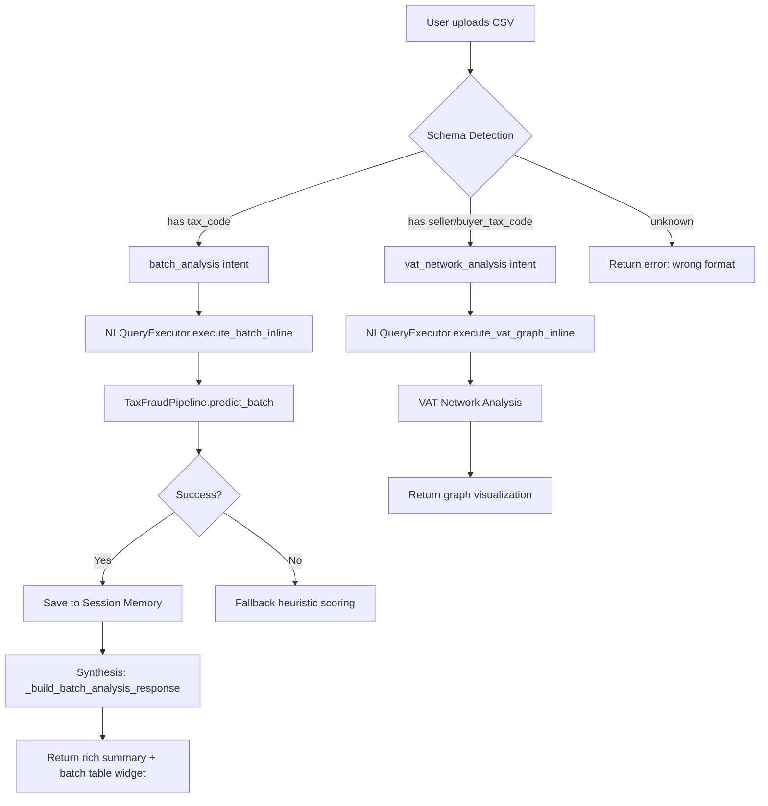
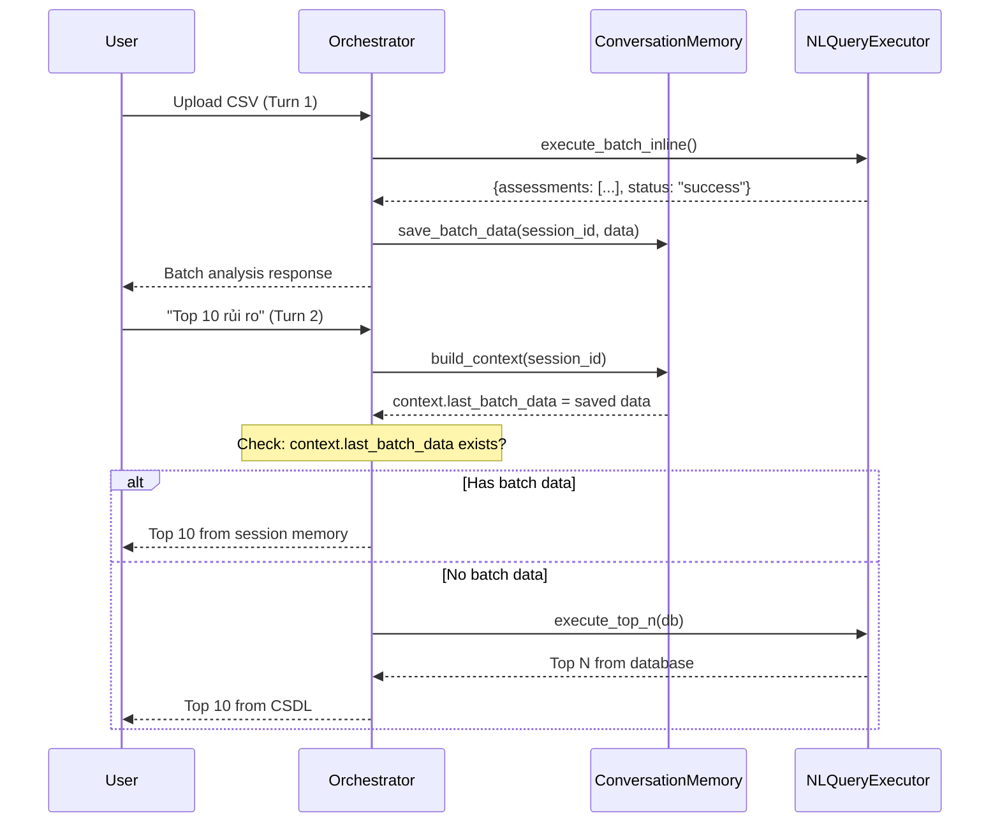

# TaxInspector Agent — Tài liệu Debug & Sửa lỗi Toàn diện

> **Mục đích:** Tài liệu kỹ thuật chi tiết để dev đọc và sửa tất cả bug còn tồn đọng trong hệ thống Agent AI.
> 
> **Ngày cập nhật:** 2026-05-05
> 
> **Trạng thái hiện tại:** Batch upload hoạt động (synthesis trả đúng), nhưng Session Memory và VAT file routing còn lỗi.

---

## Mục lục

1. [Bug #1: Session Memory không lưu dữ liệu batch](#bug-1-session-memory-không-lưu-dữ-liệu-batch)
2. [Bug #2: File VAT (hóa đơn) không được phân tích](#bug-2-file-vat-hóa-đơn-không-được-phân-tích)
3. [Bug #3: Intent "batch_analysis" leak sang lượt chat tiếp theo](#bug-3-intent-batch_analysis-leak)
4. [Bug #4: Single-query 404 cho MST từ file upload](#bug-4-single-query-404)
5. [Bug #5: Biểu đồ trong chat chưa được tích hợp](#bug-5-biểu-đồ-trong-chat)
6. [Kiến trúc tổng quan & Luồng xử lý](#kiến-trúc-tổng-quan)
7. [Test Plan](#test-plan)

---

## Bug #1: Session Memory không lưu dữ liệu batch

### Triệu chứng
- Upload `risk_data_5000_companies.csv` → batch analysis trả kết quả đúng (5000 DN)
- Hỏi "top 10 rủi ro" → **lấy từ CSDL** (5395 DN) thay vì từ file vừa upload
- Agent không nhớ dữ liệu file giữa các lượt chat

### Root Cause (Quan trọng nhất ⚠️)

**Field name mismatch** giữa `execute_batch_inline()` output và session memory save logic:

```
execute_batch_inline() trả về:        Orchestrator cố lấy:
─────────────────────────────         ──────────────────────
"assessments": [...]                  "companies": []    ← EMPTY!
"top_5": [...]                        "top_risky": []    ← EMPTY!
"by_level": {...}                     "by_level": {...}  ← OK
"total": 5000                         "total": 5000      ← OK
"status": "success"                   status check OK    ← OK
```

### File & Line cần sửa

**File:** [tax_agent_orchestrator.py](file:///e:/TaxInspector/Backend/ml_engine/tax_agent_orchestrator.py#L705-L714)

```diff
 # Session memory: save batch data for follow-up queries
 if batch_result and batch_result.get("status") in ("success", "partial", "analyzed"):
     context.last_batch_data = {
         "filename": csv_attachment.get("filename", "CSV"),
         "total": batch_result.get("total", 0),
-        "companies": batch_result.get("companies", []),
+        "companies": batch_result.get("assessments", batch_result.get("companies", [])),
         "by_level": batch_result.get("by_level", {}),
-        "top_risky": batch_result.get("top_risky", []),
+        "top_risky": batch_result.get("top_5", batch_result.get("top_risky", [])),
         "timestamp": time.time(),
     }
```

### Giải thích
`NLQueryExecutor.execute_batch_inline()` (file `tax_agent_nl_query.py` line 302) trả về dict với keys:
- `"assessments"` — danh sách tất cả DN đã chấm điểm (max 50)
- `"top_5"` — top 5 DN rủi ro cao nhất
- `"by_level"` — phân bố theo mức rủi ro

Nhưng orchestrator lại dùng `"companies"` và `"top_risky"` — các key này **không tồn tại** trong output → `batch_result.get("companies", [])` luôn trả `[]` → session memory lưu mảng rỗng → top_n_query không match session memory → fallback về CSDL.

### Kiểm tra

Sau khi sửa, kiểm tra log server khi upload file:
```
[Orchestrator] Session memory updated with batch data from risk_data.csv (50 companies)
```
- Nếu log hiện `(0 companies)` → field name vẫn sai
- `50` là max vì `execute_batch_inline` chỉ trả `assessments[:50]`

### Cải tiến thêm (Optional)

`execute_batch_inline()` chỉ trả tối đa 50 assessments (line 306). Nếu muốn session memory chứa tất cả DN:

```python
# tax_agent_nl_query.py line 306
"assessments": assessments[:50],   # ← Giới hạn 50
```

→ Cần nâng lên hoặc thêm key `"all_assessments"` riêng cho session memory:

```python
"assessments": assessments[:50],
"all_assessments_summary": [
    {"tax_code": a["tax_code"], "company_name": a.get("company_name",""), 
     "risk_score": a["risk_score"], "risk_level": a["risk_level"]}
    for a in assessments
],
```

---

## Bug #2: File VAT (hóa đơn) không được phân tích

### Triệu chứng
- Upload `vat_invoices_15000.csv` → agent trả: "Đã nhận file nhưng chưa thể phân tích batch"
- Log: `_batch_results` có `status: "error"` 

### Root Cause

**Schema mismatch:** File VAT có cột `seller_tax_code`, `buyer_tax_code`, `invoice_date`, ... nhưng **KHÔNG** có cột `tax_code`.

**Luồng xử lý hiện tại:**

```
Upload CSV → csv_attachment detected
    → intent = "batch_analysis" (line 697)
    → nl_executor.execute_batch_inline() called
        → pd.read_csv(df, dtype={"tax_code": "string"})
        → pipeline.predict_batch(df) → FAILS (no tax_code column)
        → fallback to heuristic scoring → FAILS (row.get("tax_code", ...) empty)
        → returns status="error"
```

**Vấn đề:** Không có cơ chế **detect schema** để phân biệt:
- File **Risk CSV** (có `tax_code`, `revenue`, `total_expenses`) → chạy batch scoring
- File **VAT Invoice** (có `seller_tax_code`, `buyer_tax_code`, `invoice_date`) → chạy VAT graph analysis

### File & Line cần sửa

**Giải pháp 1: Schema Detection trong orchestrator**

**File:** [tax_agent_orchestrator.py](file:///e:/TaxInspector/Backend/ml_engine/tax_agent_orchestrator.py#L694-L703)

```python
if csv_attachment:
    # Detect schema to route correctly
    csv_columns = _detect_csv_columns(csv_attachment["content"])
    
    if _is_vat_invoice_schema(csv_columns):
        intent = "vat_network_analysis"
        yield {"event": "thinking", "data": {"step": "batch", "detail": f"Phát hiện file hóa đơn VAT: {csv_attachment.get('filename')}..."}}
        # Route to VAT graph analysis instead of batch risk
        vat_result = nl_executor.execute_vat_graph_inline(
            db, csv_content=csv_attachment["content"], filename=csv_attachment["filename"],
        )
        nl_results["_vat_graph_batch_results"] = vat_result
    else:
        intent = "batch_analysis"
        yield {"event": "thinking", "data": {"step": "batch", "detail": f"Đang phân tích file {csv_attachment.get('filename')}..."}}
        batch_result = nl_executor.execute_batch_inline(
            db, csv_content=csv_attachment["content"], filename=csv_attachment["filename"],
        )
        nl_results["_batch_results"] = batch_result
```

**Helper functions cần thêm:**

```python
def _detect_csv_columns(csv_content: bytes) -> set[str]:
    """Parse first line of CSV to detect column names."""
    try:
        text = csv_content.decode("utf-8-sig", errors="replace")
        first_line = text.split("\n")[0].strip()
        return {col.strip().lower().strip('"') for col in first_line.split(",")}
    except Exception:
        return set()

def _is_vat_invoice_schema(columns: set[str]) -> bool:
    """Check if CSV has VAT invoice structure."""
    vat_markers = {"seller_tax_code", "buyer_tax_code", "invoice_date", "vat_amount"}
    return len(columns & vat_markers) >= 2
```

**Giải pháp 2: Thêm `execute_vat_graph_inline()` vào NLQueryExecutor**

**File:** [tax_agent_nl_query.py](file:///e:/TaxInspector/Backend/ml_engine/tax_agent_nl_query.py) — thêm method mới

```python
def execute_vat_graph_inline(
    self,
    db,
    *,
    csv_content: bytes,
    filename: str,
) -> dict[str, Any]:
    """Analyze VAT invoice CSV for suspicious network patterns."""
    import pandas as pd
    
    df = pd.read_csv(io.BytesIO(csv_content), low_memory=False)
    
    total_invoices = len(df)
    total_amount = df.get("total_amount", pd.Series([0])).sum()
    suspicious = df[df.get("suspicious_flag", pd.Series([0])) == 1] if "suspicious_flag" in df.columns else pd.DataFrame()
    
    # Build seller/buyer network summary
    sellers = df["seller_tax_code"].nunique() if "seller_tax_code" in df.columns else 0
    buyers = df["buyer_tax_code"].nunique() if "buyer_tax_code" in df.columns else 0
    
    return {
        "total_invoices": total_invoices,
        "total_amount": float(total_amount),
        "unique_sellers": sellers,
        "unique_buyers": buyers,
        "suspicious_count": len(suspicious),
        "suspicious_rate": round(len(suspicious) / max(1, total_invoices) * 100, 1),
        "filename": filename,
        "status": "success",
        "analysis_type": "vat_graph_csv",
    }
```

---

## Bug #3: Intent "batch_analysis" leak

### Triệu chứng
- Upload file → intent = `batch_analysis` ✅
- Hỏi "Phân tích chi tiết MST X" → intent vẫn `batch_analysis` ❌

### Root Cause
Enhanced intent classifier kế thừa `context_intents` (intent history) từ lượt trước. Khi lượt trước là `batch_analysis`, classifier bias về `batch_analysis` cho lượt tiếp.

### Đã sửa ✅ (nhưng cần kiểm tra)

**File:** [tax_agent_orchestrator.py](file:///e:/TaxInspector/Backend/ml_engine/tax_agent_orchestrator.py#L614-L623)

```python
# Intent Override: "phân tích chi tiết MST X" from row-click
_detail_keywords = ("phân tích chi tiết", "phân tích rủi ro", ...)
_has_explicit_mst = bool(re.search(r"\b\d{10}(?:-\d{3})?\b", message))
if intent in ("top_n_query", "batch_analysis") and _has_explicit_mst and _has_detail_keyword:
    intent = "general_tax_query"
    intent_conf = 0.88
```

### Vấn đề tiềm ẩn

Override chỉ bắt khi message có **cả** MST **VÀ** keyword "phân tích chi tiết". Nếu user chỉ gửi "0300003152" mà không có keyword → intent vẫn `batch_analysis`.

**Cải tiến:** Khi message chỉ chứa MST 10 chữ số (không có text khác), force intent sang `general_tax_query`:

```python
# If message is ONLY a tax code (e.g., row click sending just the MST)
_stripped = message.strip()
if re.fullmatch(r"\d{10}(-\d{3})?", _stripped) and intent == "batch_analysis":
    intent = "general_tax_query"
    intent_conf = 0.85
```

---

## Bug #4: Single-query 404

### Triệu chứng
- Click "Phân tích" trên trang Chấm điểm Rủi ro cho MST từ batch file
- Console error: `404 Not Found` hoặc `422 Unprocessable Entity`
- Error message: "Không tìm thấy doanh nghiệp MST X"

### Root Cause
Endpoint `/api/ai/single-query/{tax_code}` query `companies` table trước. MST từ file upload chỉ tồn tại trong `ai_risk_assessments` table (từ batch scoring), không có trong `companies`.

### Đã sửa ✅

**File:** [ai_analysis.py](file:///e:/TaxInspector/Backend/app/routers/ai_analysis.py#L2031-L2044)

```python
if not company:
    cached_from_batch = db.query(models.AIRiskAssessment)
        .filter(models.AIRiskAssessment.tax_code == resolved_tax_code)
        .order_by(models.AIRiskAssessment.created_at.desc())
        .first()
    if not cached_from_batch:
        raise HTTPException(status_code=404, ...)
```

### Vấn đề tiềm ẩn

Khi `company` is None nhưng `cached_from_batch` exists, code tiếp tục đến phần check `tax_returns` (line 2044) rồi `cached_assessment` (line 2053). Phần `cached_assessment` sẽ tìm thấy record vì nó cùng query `ai_risk_assessments`. Nhưng phần code sử dụng `company.name`, `company.industry` sẽ crash vì `company is None`.

**Fix cần thêm:** Tại mọi nơi dùng `company.xxx`, thay bằng safe access:

```python
# Thay:
company.name if company else ""
company.industry if company else ""

# Kiểm tra các dòng: 2260, 2261, 2152, 2153
```

---

## Bug #5: Biểu đồ trong chat

### Yêu cầu
- Upload file → agent trả biểu đồ phân tích lô (batch chart) trong chat
- Click DN → agent trả biểu đồ phân tích chi tiết (single charts) trong chat
- Tận dụng các component đã có: PCA, phân bố điểm, radar chart, v.v.

### Hiện trạng
Chưa implement. Frontend `agent_ui.js` có cơ chế render biểu đồ thông qua `visualization` field trong response payload, nhưng orchestrator chưa attach visualization data vào done event.

### Hướng triển khai

**Step 1:** Trong orchestrator, sau khi synthesis xong, attach batch visualization data:

```python
# In orchestrator done payload (around line 1230):
if intent == "batch_analysis" and "_batch_results" in all_tool_results:
    payload["visualization"] = {
        "type": "batch_charts",
        "data": {
            "by_level": batch_result.get("by_level", {}),
            "statistics": batch_result.get("statistics", {}),
            "top_risky": batch_result.get("top_5", []),
        }
    }
elif intent == "general_tax_query" and context.active_tax_code:
    # Attach single-company charts from single-query API
    payload["visualization"] = {
        "type": "single_charts", 
        "tax_code": context.active_tax_code,
        # Frontend sẽ gọi /api/ai/single-query/{tax_code} để lấy chart data
    }
```

**Step 2:** Frontend `agent_ui.js` đã có handler cho `visualization` field → kiểm tra và bổ sung rendering logic.

---

## Kiến trúc tổng quan

### Luồng xử lý khi Upload File CSV



### Luồng Session Memory



### Key Data Flow — Mapping Fields

| Source (NLQueryExecutor output) | Session Memory Key | Used By |
|---|---|---|
| `assessments` (list of scored companies) | `companies` | top_n from session |
| `top_5` (top 5 highest risk) | `top_risky` | Display in synthesis |
| `by_level` (risk distribution) | `by_level` | Distribution summary |
| `total` (total companies) | `total` | Count display |
| `filename` | `filename` | Source attribution |
| `status` | *(checked, not saved)* | Gate for saving |

> [!CAUTION]
> Hiện tại field mapping **SAI** ở orchestrator line 710-712. Fix: dùng `"assessments"` thay `"companies"`, `"top_5"` thay `"top_risky"`.

---

## Test Plan

### Test 1: Session Memory (sau khi fix Bug #1)
```
1. Restart server
2. Mở agent chat
3. Upload risk_data_5000_companies.csv
4. Chờ response "5000 doanh nghiệp đã được chấm điểm"
5. Gửi: "top 10 rủi ro nhất"
6. EXPECTED: Trả top 10 từ file (5000 tổng, KHÔNG PHẢI 5395)
7. CHECK log: "[Orchestrator] top_n served from session memory"
```

### Test 2: VAT File (sau khi fix Bug #2)
```
1. Upload vat_invoices_15000.csv
2. EXPECTED: Agent detect schema VAT → phân tích mạng lưới hóa đơn
3. EXPECTED: Trả số lượng hóa đơn, sellers, buyers, suspicious count
```

### Test 3: Intent Override (đã fix)
```
1. Upload file → batch analysis
2. Gửi: "Phân tích chi tiết MST 0300003152"
3. EXPECTED: Intent = general_tax_query (KHÔNG PHẢI batch_analysis)
4. CHECK DAG trace: "Intent: general_tax_query"
```

### Test 4: Single-query Fallback (đã fix)
```
1. Upload file CSV có MST mới (không có trong CSDL companies)
2. Vào trang Chấm điểm Rủi ro → tra cứu MST đó
3. EXPECTED: Tìm thấy và hiển thị từ AIRiskAssessment cache
```

### Test 5: Biểu đồ trong chat (chưa implement)
```
1. Upload file → hỏi "cho tôi biểu đồ phân tích tổng thể"
2. EXPECTED: Biểu đồ batch (pie chart, histogram) render trong chat
3. Click DN → hỏi "biểu đồ rủi ro DN này"
4. EXPECTED: Biểu đồ single-company (radar, timeline) render trong chat
```

---

## Tóm tắt Ưu tiên

| # | Bug | Mức độ | Ước lượng | Trạng thái |
|---|-----|--------|-----------|------------|
| 1 | Session Memory field mismatch | 🔴 Critical | 5 phút | **Cần fix** |
| 2 | VAT file schema detection | 🟠 High | 30 phút | **Cần fix** |
| 3 | Intent batch_analysis leak | 🟡 Medium | ✅ Đã fix | Done |
| 4 | Single-query 404 fallback | 🟡 Medium | ✅ Đã fix | Done |
| 5 | Biểu đồ trong chat | 🟢 Enhancement | 2-3 giờ | Chưa implement |
