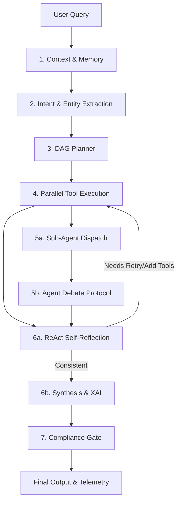

# 🧠 Kiến trúc Multi-Agent TaxInspector (Tài liệu Kỹ thuật Chi tiết)

> **Phiên bản:** 2.0 (Cập nhật: 01/05/2026)  
> **Mục tiêu:** Tài liệu này đóng vai trò là "Kinh thánh" (Source of Truth) cho hệ thống Multi-Agent của nền tảng TaxInspector. Các lập trình viên/Kỹ sư AI tương lai cần đọc kỹ tài liệu này trước khi tiến hành nâng cấp, sửa đổi hoặc thêm mới các mô hình học máy vào hệ thống.

---

## I. Tầm nhìn Kiến trúc (Architectural Vision)

Hệ thống AI của TaxInspector không phải là một chatbot LLM thông thường. Đây là một **Hệ thống Đa Tác tử (Multi-Agent System) có tính xác định cao (Deterministic), có khả năng tự suy luận (ReAct) và tranh luận (Debate)**. 

Hệ thống được thiết kế dựa trên 3 trụ cột của ngành AI tài chính/chính phủ:
1. **Tính Minh bạch (Transparency):** Mọi quyết định, sự bất đồng giữa các tác tử (agents) đều được ghi nhận và hiển thị cho thanh tra viên (thông qua XAI và Debate Protocol).
2. **Tính Tuân thủ (Compliance):** Các luồng thông tin đều đi qua `ComplianceGate` để đảm bảo tuân thủ nghiêm ngặt chính sách bảo mật và quy định của ngành Thuế.
3. **Hiệu suất & Ổn định (Production-Grade):** Thực thi công cụ song song (DAG-based Tool Execution), xử lý luồng dữ liệu thời gian thực (SSE Streaming) và quản lý retry/timeout tự động.

---

## II. Luồng Xử lý Cốt lõi (The 7-Step Orchestrator Pipeline)

Mọi yêu cầu từ người dùng đều đi qua `TaxAgentOrchestrator` (`tax_agent_orchestrator.py`) và tuân theo một quy trình 7 bước nghiêm ngặt.

### Chi tiết 7 Bước:
1. **Build Context (`ConversationIntelligence`)**: Trích xuất ngữ cảnh từ lịch sử hội thoại, giải quyết đại từ nhân xưng (Coreference Resolution - ví dụ: "công ty đó" -> "MST: 0101234567").
2. **Classify Intent (`EnhancedIntentClassifier`)**: Phân loại ý định người dùng (Semantic + Multi-intent). Nếu độ tin cậy thấp, hệ thống tự động fallback về rule-based.
3. **Plan Execution (`TaxAgentPlanner`)**: Lập sơ đồ đồ thị có hướng (DAG) các công cụ (Tools) cần chạy. Quyết định công cụ nào chạy trước, công cụ nào có thể chạy song song (Parallel).
4. **Execute Tools (`ToolExecutor`)**: Chạy các công cụ dựa trên DAG. Hệ thống hỗ trợ xử lý luồng đồng thời bằng `ThreadPoolExecutor`, tự động retry khi gặp lỗi, và có timeout protection.
5. **Debate Protocol (`AgentDebateProtocol`)**: Gửi dữ liệu thu thập được cho 3 Sub-Agents chuyên biệt (Pháp lý, Phân tích, Điều tra). Các agents này sẽ đưa ra quan điểm độc lập. Bất kỳ sự mâu thuẫn nào cũng sẽ được ghi nhận và tổng hợp.
6. **ReAct Loop & Synthesize (`ReActEngine` + `TaxAgentSynthesizer`)**: Động cơ ReAct đánh giá kết quả. Nếu thiếu dữ liệu hoặc có mâu thuẫn nghiêm trọng, hệ thống tự động chạy thêm tool (Max 3 iterations). Sau đó, Synthesizer sẽ đúc kết thành câu trả lời ngôn ngữ tự nhiên.
7. **Compliance Check (`TaxAgentComplianceGate`)**: Quét câu trả lời cuối cùng để chặn các rò rỉ dữ liệu nhạy cảm hoặc vi phạm chính sách trước khi trả về Frontend (SSE Stream).

---

## III. Các Module Trọng tâm (Deep-Dive)

### 1. Multi-Agent Debate Protocol (`tax_agent_debate.py`)
Lấy cảm hứng từ nghiên cứu của *Du et al., "Improving Factuality and Reasoning in Language Models through Multiagent Debate" (ICML 2023)*.
- **Sub-Agents:** 
  - ⚖️ **LegalResearchAgent:** Đánh giá rủi ro pháp lý, thông tư vi phạm. (Trọng số: 0.20)
  - 📊 **AnalyticsAgent:** Đánh giá rủi ro từ các mô hình định lượng ML. (Trọng số: 0.45)
  - 🔍 **InvestigationAgent:** Phát hiện các mẫu giao dịch đáng ngờ, red flags. (Trọng số: 0.35)
- **Cơ chế:** Phân tích `Stance` (An toàn, Cần lưu ý, Đáng ngờ, Nguy hiểm) của từng Agent một cách độc lập (Deterministic). Tính toán `DisagreementSeverity` (Minor, Moderate, Major, Critical). Sử dụng tính toán phi tuyến tính để tổng hợp mức độ đồng thuận cuối cùng và bảo tồn các **Minority Opinions** (Ý kiến thiểu số).

### 2. ReAct Self-Reflection Engine (`tax_agent_react.py`)
Triển khai kỹ thuật ReAct (*Reason + Act, Yao et al. ICLR 2023*).
- Không giống các chatbot dùng LLM API đắt đỏ, engine này dùng **Rule-based Reflection** siêu nhanh (<50ms).
- **Chức năng:** Phát hiện mâu thuẫn giữa các Tool (ví dụ: XGBoost báo rủi ro thấp nhưng Hetero-GNN báo cao), Tool bị lỗi (Missing data), Dấu hiệu bất thường (Anomalies).
- **Hành động (Actions):** Có thể tự động yêu cầu `RETRY_TOOL`, `ADD_TOOL` (ví dụ tự thêm VAE scan nếu GNN và XGBoost cãi nhau), hoặc `TRIGGER_INVESTIGATION`. Số vòng lặp bị giới hạn chặt ở `MAX_ITERATIONS = 3`.

### 3. Explainable AI & Observability (`tax_agent_xai.py` & `model_registry.py`)
- **XAI:** Tự động tạo biểu đồ SHAP (Waterfall), VAE Breakdowns và phân tích nhân quả (Counterfactual) từ kết quả của các ML tools. Trả dữ liệu dạng JSON cho Frontend `ECharts` vẽ trực quan.
- **Registry & Telemetry:** Mọi inference, độ trễ (latency), và tools_used đều được log lại bằng `ModelRegistryService` và hiển thị trên Dashboard `telemetry.html`.

---

## IV. Kho Vũ khí ML/DL (Tool Registry)

Hệ thống hiện sở hữu **18 công cụ** được đăng ký trong `tax_agent_tools.py`. Đây là trái tim sức mạnh của TaxInspector.

| Nhóm | Công cụ (Tool Name) | Mô hình / Kỹ thuật Backend | Mục đích |
|:---|:---|:---|:---|
| **Retrieval** | `knowledge_search` | BM25 + BGE Dense + Cross-Encoder | Tìm kiếm thông tư, luật |
| | `company_name_search` | Fuzzy Text Matching | Tra cứu tên DN |
| **Analytics** | `company_risk_lookup` | XGBoost + IsolationForest | Điểm rủi ro tổng hợp |
| | `delinquency_check` | DelinquencyPipeline Ensemble | Đánh giá nợ thuế |
| | `invoice_risk_scan` | Rules & Aggregation | Quét rủi ro hóa đơn |
| | `top_n_risky_companies` | Text-to-SQL | Báo cáo danh sách |
| **Deep Learning** | `temporal_delinquency_deep` | **Temporal Transformer** | Dự báo nợ theo chuỗi thời gian |
| | `gnn_analysis` | **GATv2** (Graph Attention) | Phân tích đồ thị mạng lưới |
| | `hetero_gnn_risk` | **HGTConv** (Heterogeneous) | Đồ thị không đồng nhất (VAT) |
| | `vae_anomaly_scan` | **β-VAE** | Autoencoder tìm điểm dị thường |
| **Investigation** | `motif_detection` | Graph Pattern Mining | Tìm mẫu Carousel/Shell/Layering |
| | `ownership_analysis` | Graph Traversal | Phân tích sở hữu chéo |
| | `entity_resolution_check` | **Siamese Bi-Encoder** + Jaro | Phát hiện trùng lặp, cty ma |
| **NLP & Docs** | `nlp_red_flag_scan` | **BERT (Fine-tuned)** | Phân tích mô tả giao dịch |
| | `ocr_document_process` | **PaddleOCR** | Bóc tách trường dữ liệu hóa đơn |
| **Forecasting**| `revenue_forecast` | **LightGBM / ARIMA** | Dự báo thu ngân sách |
| | `macro_forecast` | Causal Inference | Mô phỏng chính sách vĩ mô |
| **Causal AI** | `causal_uplift_recommend` | **T-Learner** (Propensity Score) | Tối ưu hóa can thiệp thu nợ |

## V. Nhật ký Khắc phục Sự cố (Stability & Debugging Log)

Trong quá trình stress-test và audit (01/05/2026), các lỗi Database và logic dưới đây đã được khắc phục để đảm bảo hệ thống Multi-Agent hoạt động ổn định 100%:
1. **Lỗi `InFailedSqlTransaction` do Missing Table:** Quá trình lưu Entity Memory thất bại do bảng `agent_entity_memory` chưa được định nghĩa trong `models.py`. Đã thêm model `AgentEntityMemory` với UniqueConstraint để hỗ trợ UPSERT và tự động tạo bảng.
2. **Lỗi Schema bất đồng bộ trong Tools:** 
   - `company_risk_lookup` truy vấn cột `company_name`, `risk_level` không tồn tại trong model `Company`. Đã điều chỉnh để map đúng với schema hiện tại (sử dụng cột `name`, `is_active`).
   - `invoice_risk_scan` truy vấn cột `risk_label` không tồn tại trong `invoices`. Đã thêm trường `risk_label = Column(Integer, default=0)` vào `app/models.py`.
3. **Lỗi Parameter Mismatch trong Planner:** `TaxAgentOrchestrator` truyền sai tham số `entities` vào `TaxAgentPlanner.plan()`. Đã sửa lại để truyền đúng các biến `query`, `tax_code`, `tax_period` và `context_intents`.
4. **Lỗi MultiIntentResult Attributes:** `tax_agent_enhanced_intent.py` trả về `MultiIntentResult` không có `all_intents` và `tier`. Đã sửa thành `secondary_intents` và `classification_source` trong Orchestrator.

---

## VI. Cẩm nang Nâng cấp (Roadmap & Technical Debt)

Khi tiếp quản hệ thống này, các Lập trình viên cần lưu ý giải quyết các **Technical Debt** sau trước khi thêm tính năng mới:

### 1. Refactor Orchestrator Duplicate Code (Ưu tiên Cao)
Hiện tại file `tax_agent_orchestrator.py` có một lượng code bị lặp lại (~500 dòng) ở phần cuối của method `process_streaming()` (từ dòng 734 trở đi). Phần code lặp lại này mô phỏng logic của method `process()` non-streaming.
* **Cách giải quyết:** Cần tạo một private method `_run_pipeline()` trả về một Dataclass (`_PipelineResult`). `process()` và `process_streaming()` sẽ gọi chung hàm này. Hãy cẩn thận với cơ chế `yield` của luồng streaming.

### 2. Chuyển đổi sang Async/Await cho Tool Executor (Ưu tiên Trung bình)
`ToolExecutor` hiện đang dùng `ThreadPoolExecutor` (Synchronous/Multi-threading). Với 18 công cụ, đa số là gọi I/O tới Database hoặc gRPC tới mô hình PyTorch. 
* **Cách giải quyết:** Migrate sang hệ sinh thái `asyncio`. Sử dụng `asyncio.gather()` để chạy tools. Việc này sẽ giảm Latency tổng thể khoảng 30-50% trong các kịch bản tải nặng.

### 3. Multi-Round Debate & LLM Arbitration (Tương lai)
Protocol tranh luận hiện tại là Single-round (Các agent nói 1 lần rồi tổng hợp).
* **Nâng cấp:** Triển khai Iterative Refinement. Cho phép các Agents phản biện lại (Cross-examination) nếu có mâu thuẫn `CRITICAL`. Có thể dùng LLM đóng vai trò Quan tòa (Arbitrator) để phân xử thay vì chỉ dùng Weighted Math.

### 4. Adaptive Tool Selection (Bandit-Style)
Hiện tại `TaxAgentPlanner` lên DAG cố định dựa vào Intent. 
* **Nâng cấp:** Tích hợp Contextual Bandits (Reinforcement Learning) để Orchestrator tự học xem với hồ sơ DN kiểu nào thì Tool nào mang lại Information Gain cao nhất, giúp tiết kiệm Compute Resource.

---

**[Kết thúc Tài liệu]** - *Hệ thống này được xây dựng hướng tới tiêu chuẩn của các nền tảng trí tuệ nhân tạo chuyên ngành của các tập đoàn công nghệ lớn (Tier-1 AI Platforms).*
