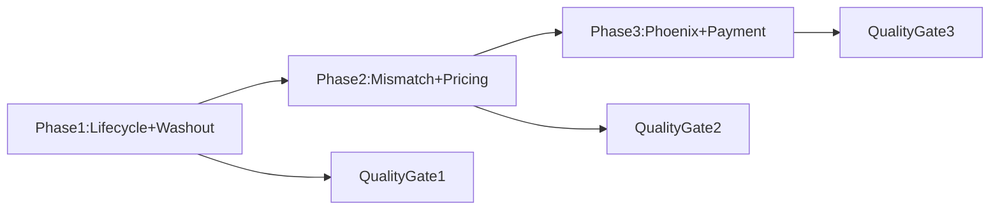

# VAT Graph Missing Capabilities Blueprint

This document implements the requested blueprint deliverables for VAT Graph:

1. Gap matrix (implemented vs missing)
2. New Graph API forensic contract design
3. Detailed feature formulas for 6 missing capabilities
4. Integration order by impact/effort/data dependency
5. Acceptance criteria and quality gates

Scope references:
- `Backend/app/routers/graph.py`
- `Backend/ml_engine/gnn_model.py`
- `Frontend/js/graph.js`
- Existing non-graph risk stack: `Backend/ml_engine/train_model.py`, `Backend/ml_engine/train_vat_refund.py`, `Backend/ml_engine/train_audit_value.py`

---

## 1) Gap Matrix (Already Implemented vs Missing)

| Capability | Existing Coverage | Gap Level | Where It Exists Today | What Is Missing For VAT Graph |
|---|---|---|---|---|
| Invoice lifecycle integrity (cancel/replace/adjusted) | Minimal | Critical | No dedicated lifecycle state in graph edges | Effective edge state, cancellation timelines, integrity alerts |
| VAT washout layering (non-cycle) | Partial | High | Ring/cycle and suspicious edges in GNN/forensic | Persistent in-out equilibrium score for linear layering nodes |
| Industry-goods mismatch at edge level | Partial | High | Node industry embeddings exist | Edge-level industry-goods risk matrix and mismatch persistence |
| Phoenix sequencing | Minimal | High | Ownership and graph structure only | Successor inference and risk inheritance between entities |
| Trade-based pricing anomaly | Minimal | High | Generic anomaly scoring exists outside graph | Unit price baseline by context and robust outlier scoring |
| Invoice-payment consistency | Minimal | High | Invoice-only graph edges | Payment match pipeline and settlement anomaly signals |

### Non-overlap guardrail

Graph additions must remain graph-forensic and transaction-contextual. If a signal is purely enterprise static finance risk, it should stay in Fraud core and be imported as context only.

---

## 2) Graph API Contract Design

Design goal: extend `/api/graph` response in backward-compatible way with three new blocks:

- `integrity_signals`
- `pricing_signals`
- `phoenix_signals`

### 2.1 Response extension (contract v2.1)

```json
{
  "contract_version": "graph-intelligence-v2.1",
  "nodes": [],
  "edges": [],
  "forensic_metrics": {},
  "integrity_signals": {
    "available": true,
    "coverage": {
      "lifecycle_events_present_ratio": 0.71,
      "invoice_payment_link_ratio": 0.64
    },
    "summary": {
      "risk_level": "high",
      "risk_score": 78.3,
      "canceled_edge_count": 124,
      "replaced_edge_count": 39,
      "cross_party_mismatch_count": 12
    },
    "top_incidents": [
      {
        "incident_id": "INT-2026-04-001",
        "type": "issued_then_canceled_after_claim_window",
        "invoice_number": "INV-001",
        "seller_tax_code": "0101234567",
        "buyer_tax_code": "0107654321",
        "severity": "critical",
        "event_timeline": [
          { "event": "issued", "timestamp": "2026-03-30T09:12:00Z" },
          { "event": "canceled", "timestamp": "2026-04-14T16:05:00Z" }
        ]
      }
    ]
  },
  "pricing_signals": {
    "available": true,
    "summary": {
      "risk_level": "medium",
      "risk_score": 54.2,
      "high_deviation_invoice_count": 87,
      "round_price_abuse_count": 21
    },
    "top_outliers": [
      {
        "invoice_number": "INV-777",
        "goods_category": "steel",
        "unit": "kg",
        "observed_unit_price": 23800.0,
        "baseline_median": 14800.0,
        "unit_price_z": 4.8,
        "price_deviation_score": 0.93
      }
    ]
  },
  "phoenix_signals": {
    "available": true,
    "summary": {
      "suspected_successions": 9,
      "high_confidence_successions": 3
    },
    "suspicions": [
      {
        "predecessor_tax_code": "0102222222",
        "successor_tax_code": "0103333333",
        "successor_similarity": 0.87,
        "time_to_reincorporate_days": 11,
        "risk_inheritance_score": 0.74
      }
    ]
  }
}
```

### 2.2 Node extension

Each node may include:

- `vat_washout_score` (0-1)
- `industry_mismatch_exposure` (0-1)
- `phoenix_candidate_score` (0-1)

### 2.3 Edge extension

Each edge may include:

- `lifecycle_state` (`issued|replaced|canceled|adjusted`)
- `effective` (bool)
- `industry_goods_mismatch_score` (0-1)
- `price_deviation_score` (0-1)
- `invoice_payment_match_score` (0-1)

### 2.4 Compatibility behavior

If any block is unavailable due to missing source tables/data:

- Keep the block present with `available=false`
- Fill `reason` with one of:
  - `missing_source_table`
  - `insufficient_coverage`
  - `upstream_not_integrated`

---

## 3) Feature Specifications (Formulas)

Notation:
- `in_t(node,t)`: total incoming amount for node in period `t`
- `out_t(node,t)`: total outgoing amount for node in period `t`
- `eps`: small constant `1e-6`

### 3.1 Invoice Lifecycle Integrity

- `cancel_rate(node) = canceled_edges(node) / max(1, issued_edges(node))`
- `replace_latency(invoice) = ts_replace - ts_issue` (hours)
- `quarter_end_issue_then_cancel_flag = 1` if issue in final N days of quarter and canceled within M days after quarter close
- `cross_party_mismatch_count`: seller/buyer lifecycle disagreement count

`integrity_risk_score` (0-100):

```
score = 35 * cancel_rate_norm
      + 25 * replace_burst_norm
      + 20 * mismatch_norm
      + 20 * quarter_end_pattern_norm
```

### 3.2 VAT Washout / Layering

- `in_out_balance_ratio_t = min(in_t, out_t) / max(eps, max(in_t, out_t))`
- `balance_stability_k = 1 - std(in_out_balance_ratio_t over last k periods)`
- `vat_washout_score = mean(1[ratio_t >= 0.99]) * balance_stability_k`
- `layer_chain_depth`: longest non-cyclic suspicious transfer path depth

Node alert rule:
- High if `vat_washout_score >= 0.8` and `layer_chain_depth >= 3`

### 3.3 Industry-Goods Mismatch

Given compatibility matrix `C[industry,goods] in [0,1]`:

- `industry_goods_mismatch_score(edge) = 1 - C[seller_industry, goods_category]`
- `high_value_mismatch_ratio(node) = sum(amount of mismatch edges > threshold) / total_amount(node)`
- `mismatch_persistence(node) = fraction of periods where mismatch ratio exceeds threshold`

### 3.4 Phoenix Sequencing

Successor similarity components:
- `addr_sim`, `owner_sim`, `counterparty_jaccard`, `flow_pattern_sim`, `industry_sim`, `time_decay`

```
successor_similarity =
  0.22*addr_sim +
  0.22*owner_sim +
  0.20*counterparty_jaccard +
  0.18*flow_pattern_sim +
  0.08*industry_sim +
  0.10*time_decay
```

- `time_to_reincorporate_days = reg_date(B) - close_date(A)`
- `risk_inheritance_score = successor_similarity * predecessor_risk_score_norm`

### 3.5 Trade-based Pricing Anomaly

Baseline group key:
- `(industry, goods_category, month_bucket, region, unit)`

Per invoice:
- `unit_price = amount / max(quantity, eps)`
- `unit_price_z = (unit_price - median_group) / max(mad_group, eps)`
- `price_deviation_score = sigmoid(|unit_price_z| - z_threshold)`
- `round_price_abuse = 1` for suspicious price endings frequency pattern

Entity aggregation:
- `counterparty_price_dispersion = std(unit_price by repeated counterparty and goods)`

### 3.6 Invoice-Payment Consistency

Invoice-payment linking score:

```
link_score =
  0.5 * amount_match +
  0.3 * time_window_match +
  0.2 * counterparty_match
```

- `invoice_payment_match_rate = matched_invoices / total_invoices`
- `payment_lag_anomaly = robust_z(payment_lag_days)`
- `third_party_settlement_flag = 1` if payer != buyer in linked settlement

---

## 4) Integration Order (Impact/Effort/Dependencies)

### Phase 1 (Highest priority, lowest dependency risk)
1. Invoice lifecycle integrity
2. VAT washout layering

Why first:
- Immediate fraud detection lift
- Works with existing invoice/graph infrastructure
- Minimal UI architecture changes

### Phase 2
3. Industry-goods mismatch
4. Trade-based pricing anomaly

Dependency:
- Reliable `goods_category`, `quantity`, `unit` normalization
- Reference compatibility matrix and pricing baseline service

### Phase 3
5. Phoenix sequencing
6. Invoice-payment consistency

Dependency:
- Entity resolution utilities
- Payment data ingestion and linkage tables

### Rollout architecture



---

## 5) Acceptance Criteria and Quality Gates

## 5.1 Capability-level acceptance

Each capability is accepted only if all conditions pass:

- Feature computed on >= 85% target scope rows or explicit `missing_coverage` semantics.
- Risk score produced with explainable factors (top contributors).
- Exposed in `/api/graph` payload under the designed block.
- Rendered in forensic UI without breaking existing graph interactions.
- Added synthetic regression test for positive/negative scenarios.

### 5.2 Global graph quality gates (non-regression)

Must not degrade existing GNN serving quality:
- `node_f1_parity >= 0.95`
- `edge_f1_parity >= 0.95`
- `node_pr_auc_drop <= 0.02`
- `edge_pr_auc_drop <= 0.02`

Source report:
- `Backend/data/models/serving_e2e_report.json`

### 5.3 New forensic gates

- Integrity gate:
  - Detection precision on synthetic cancel/replace scenarios >= 0.80
- Pricing gate:
  - Top-K outlier precision >= 0.70 on labeled anomaly slices
- Phoenix gate:
  - Successor link precision >= 0.75 on adjudicated samples
- Payment gate:
  - Invoice-payment linkage F1 >= 0.85

### 5.4 Runtime and payload gates

- `/api/graph` p95 latency increase <= 25% after each phase.
- Payload size increase bounded via top-K truncation and lazy forensic loads.
- If source data absent, response remains contract-valid with `available=false`.

---

## Implementation Notes

- Prefer extracting new logic into dedicated modules (example: `graph_feature_pipeline.py`) and keep `gnn_model.py` focused on model inference.
- Keep the existing frontend layout in `Frontend/js/graph.js`; add sections to current forensic strips/tabs instead of creating another page.
- Preserve backward compatibility in API while incrementing `contract_version`.
