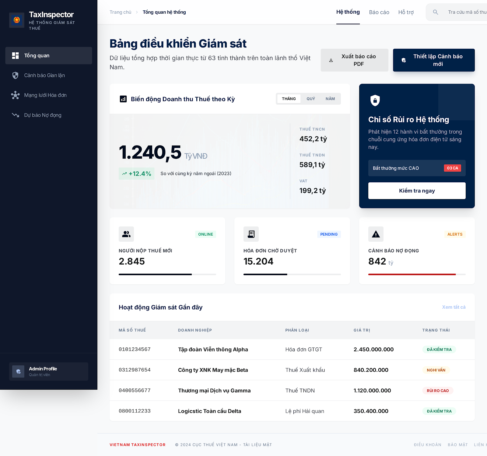
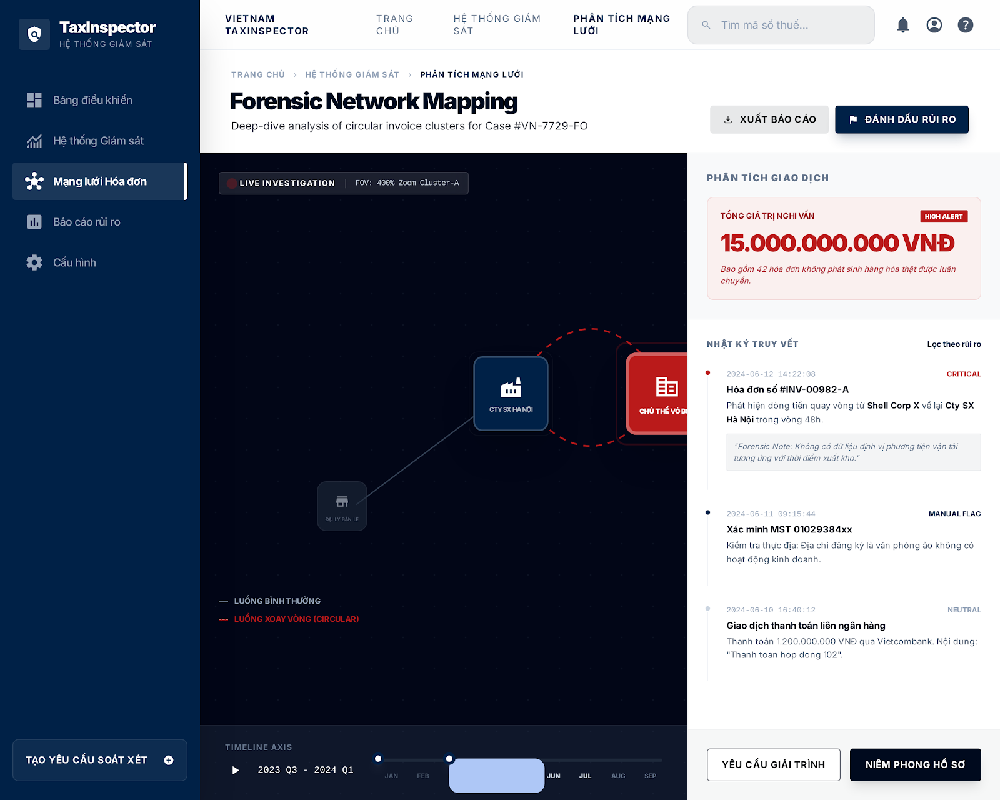
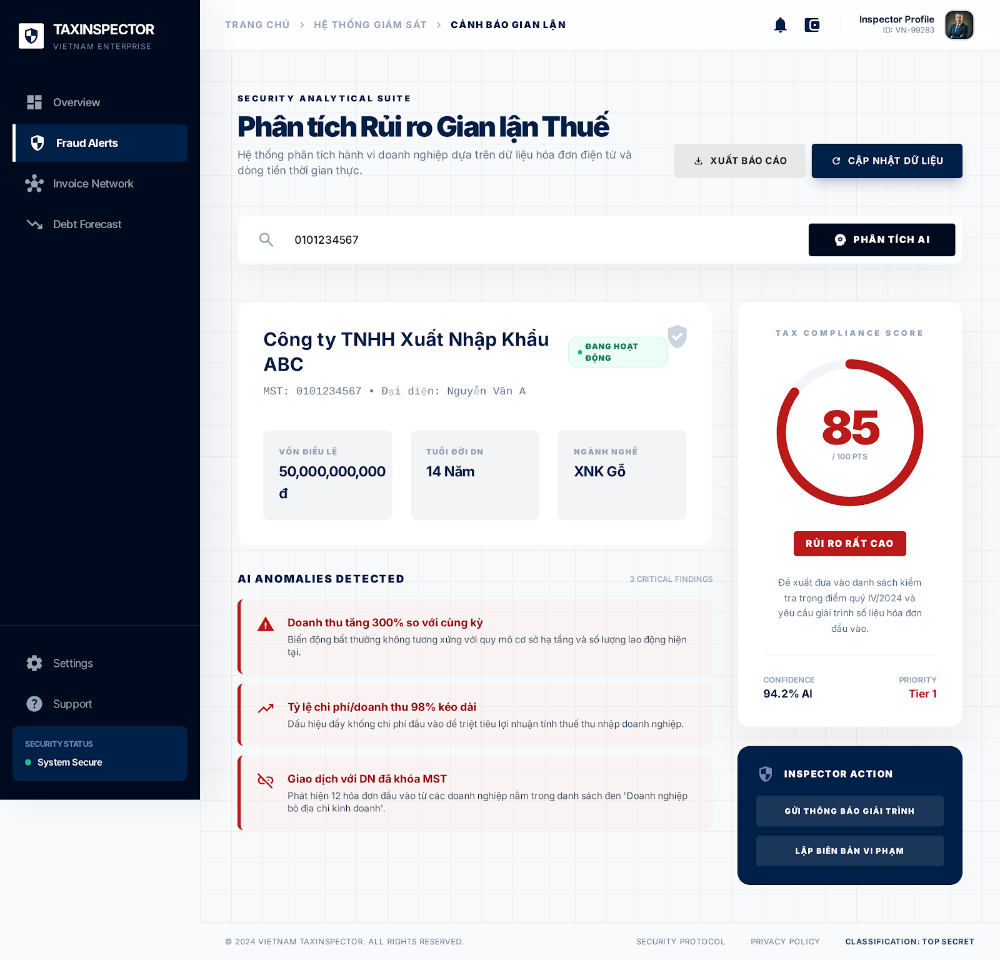
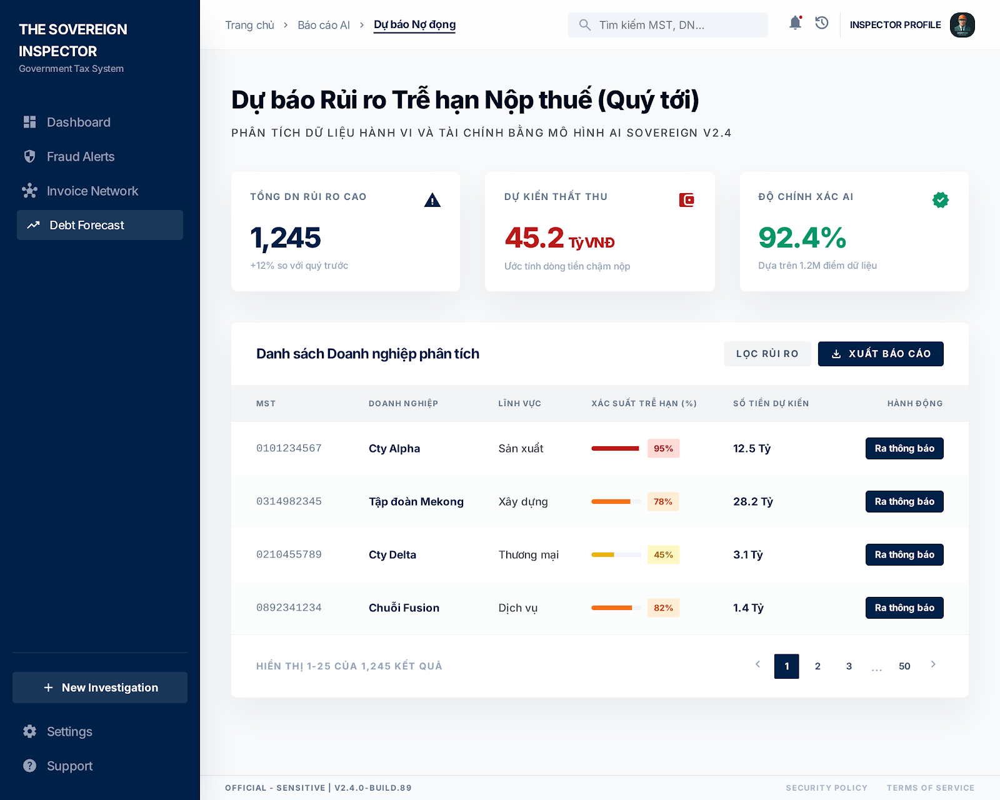

# 🇻🇳 Vietnam TaxInspector
### AI-Powered Sovereign Tax Surveillance & Risk Analytics Suite

[](https://fastapi.tiangolo.com/)
[](https://www.postgresql.org/)
[](https://tailwindcss.com/)

**Vietnam TaxInspector** là hệ thống phân tích dữ liệu thuế tiên tiến, kết hợp giữa Trí tuệ nhân tạo (Machine Learning) và Phân tích Đồ thị (Graph Analytics) nhằm hỗ trợ cơ quan Nhà nước trong việc phát hiện gian lận và tối ưu hóa quản lý nợ đọng thuế.

---

## 🌟 Tính Năng Cốt Lõi (Core Features)

### 📊 1. Trung Tâm Giám Sát (Unified Dashboard)
Giao diện quản lý tập trung hiển thị biến động doanh thu, chỉ số rủi ro hệ thống và các cảnh báo khẩn cấp theo thời gian thực từ 63 tỉnh thành.

### 🛡️ 2. Chấm Điểm Rủi Ro (Fraud Scoring)
Hệ thống **Security Analytical Suite** phân tích hành vi doanh nghiệp dựa trên hóa đơn điện tử và dòng tiền. Sử dụng các mô hình AI để gán nhãn mức độ nghi vấn rủi ro thuế (Thấp - Trung bình - Cao).

### 🕸️ 3. Mạng Lưới Điều Tra (Forensic Network Mapping)
Truy vết các chuỗi hóa đơn xoay vòng, công ty "ma" thông qua thuật toán đồ thị (Graph Algorithms). Phát hiện các cụm giao dịch bất thường trong mạng lưới hàng triệu mã số thuế.

### 📉 4. Dự Báo Nợ Đọng (Delinquency Prediction)
Dự báo khả năng trễ hạn nộp thuế trong quý tới của doanh nghiệp bằng mô hình AI Sovereign v2.4, giúp cán bộ thuế chủ động trong việc đốc thúc và quản lý dòng tiền ngân sách.

---

## 📸 Hình Ảnh Giao Diện (Preview)

| Dashboard | Mạng Lưới VAT |
| :---: | :---: |
|  |  |

| Chấm Điểm Rủi Ro | Dự Báo Nợ Đọng |
| :---: | :---: |
|  |  |

---

## 🛠️ Kiến Trúc Công Nghệ (Tech Stack)

*   **Backend:** Python 3.9+, FastAPI, SQLAlchemy (ORM).
*   **Database:** PostgreSQL (Lưu trữ quan hệ và dữ liệu hóa đơn).
*   **Frontend:** HTML5, Vanilla JavaScript, TailwindCSS (Modern "Office White" Design System).
*   **Analytics:** NetworkX (Xử lý đồ thị), Scikit-learn/XGBoost (Mô hình dự báo).

---

## 🚀 Hướng Dẫn Cài Đặt (Quick Start)

### 1. Chuẩn bị Cơ sở dữ liệu
Đảm bảo bạn đã cài đặt **PostgreSQL** và tạo một database tên là `TaxInspector`. Sử dụng file schema tại `Database/init_db.sql` (nếu có) để khởi tạo cấu trúc.

### 2. Thiết lập Backend
```bash
cd Backend
python -m venv venv
source venv/bin/activate  # Trên Windows: .\venv\Scripts\activate
pip install -r requirements.txt
uvicorn app.main:app --reload --port 8000
```

### 3. Khởi tạo Frontend
Vì lý do bảo mật trình duyệt, hãy chạy một local server nhẹ:
```bash
cd Frontend
python -m http.server 3000
```
Truy cập: **http://localhost:3000** để bắt đầu.

---

## 🔒 Bảo Mật (Security)
Dự án được thiết kế với các quy tắc bảo mật nghiêm ngặt:
- Mã hóa mật khẩu PBKDF2.
- Xác thực phiên làm việc bằng JWT (JSON Web Token).
- Hệ thống `.gitignore` chặn các file cấu hình nhạy cảm `.env` chứa thông tin kết nối database.

---
**Phát triển bởi:** [TruongVinhKiet](https://github.com/TruongVinhKiet)
*Dự án phục vụ mục đích nghiên cứu và demo giải pháp công nghệ số trong quản lý công.*
