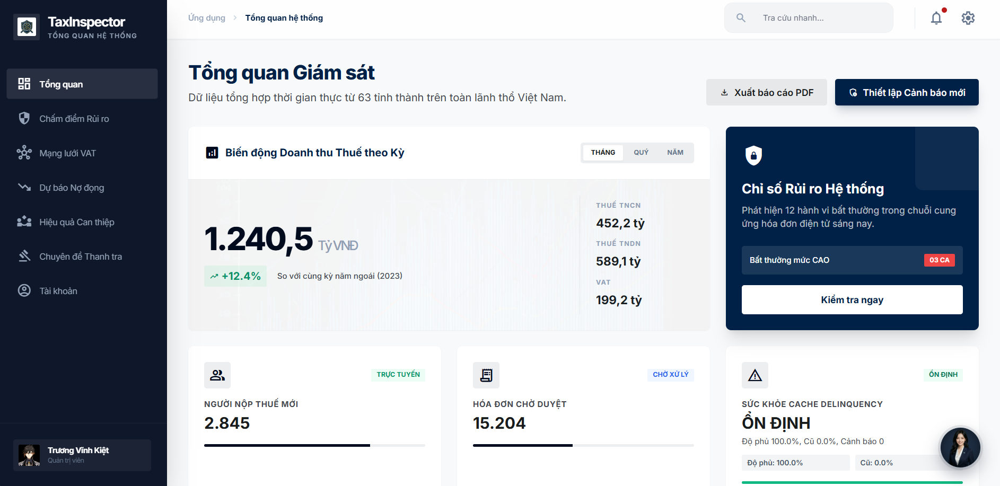
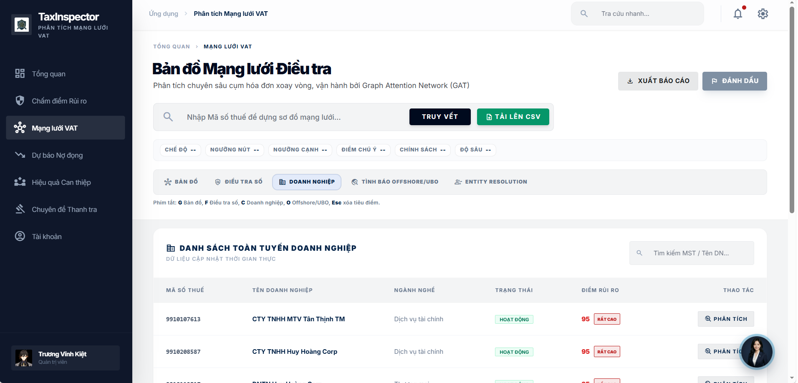
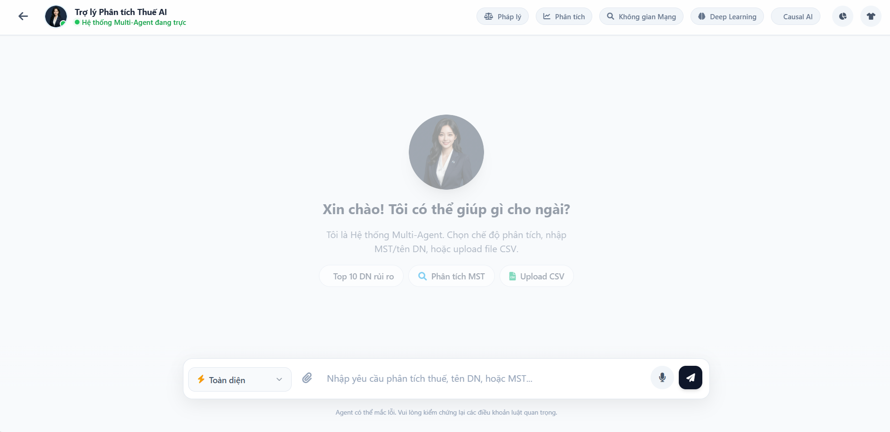
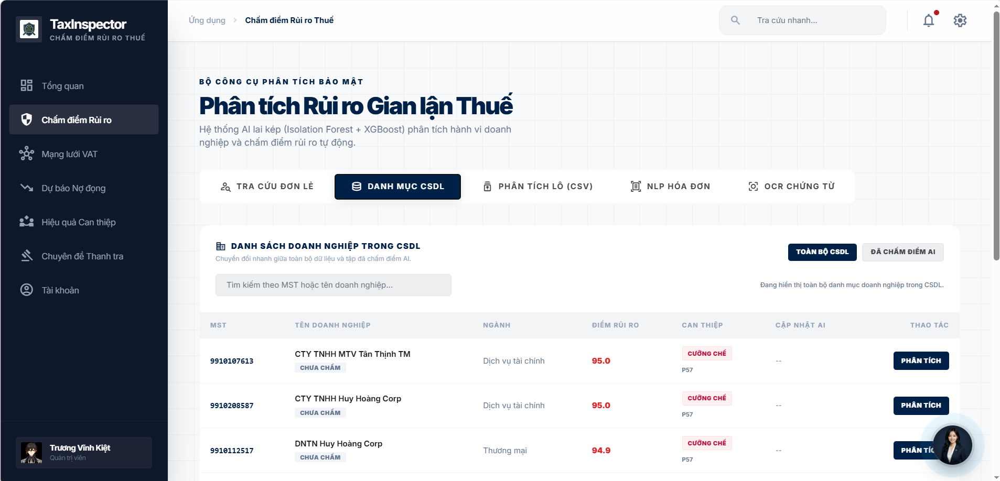
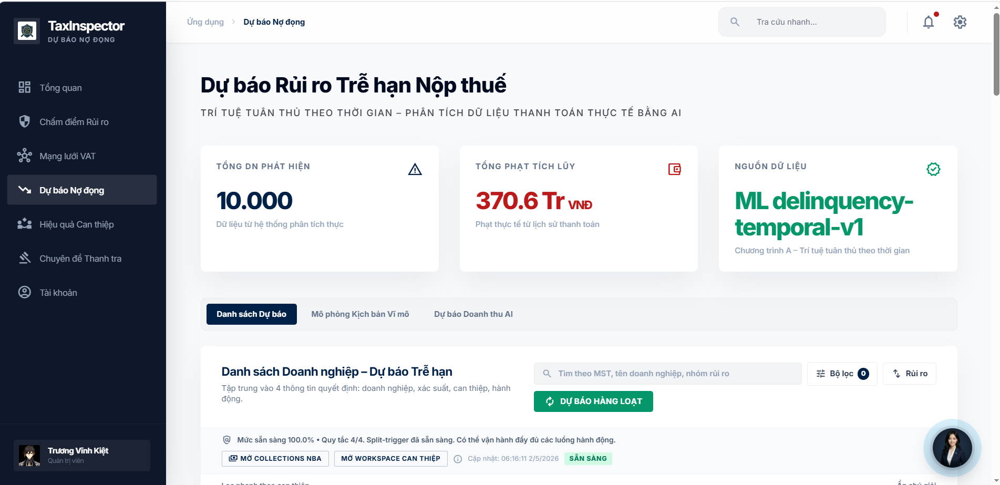
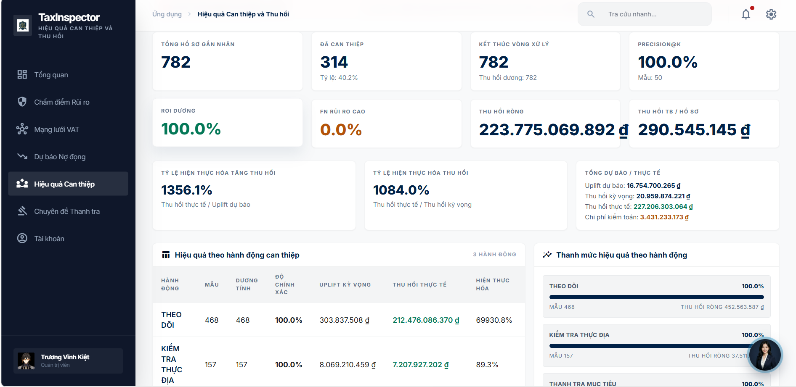
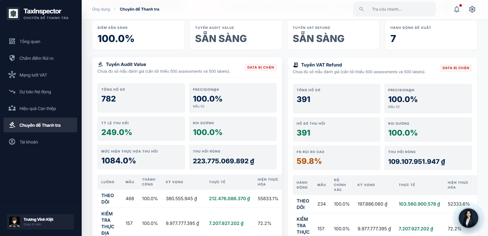
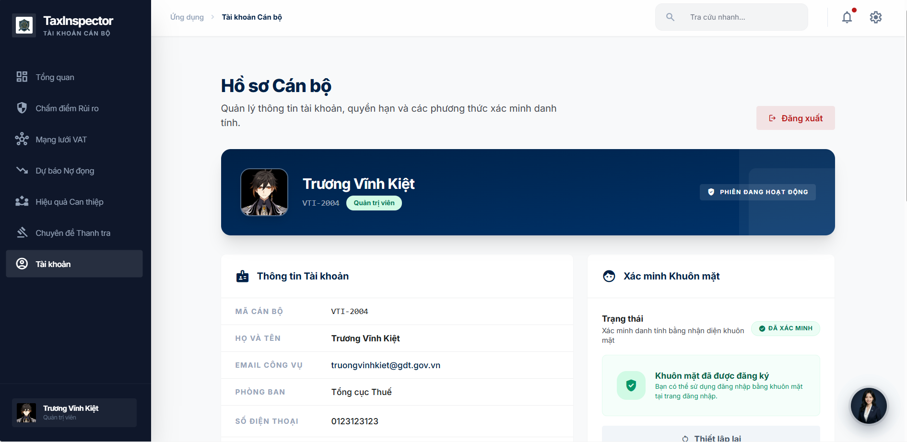
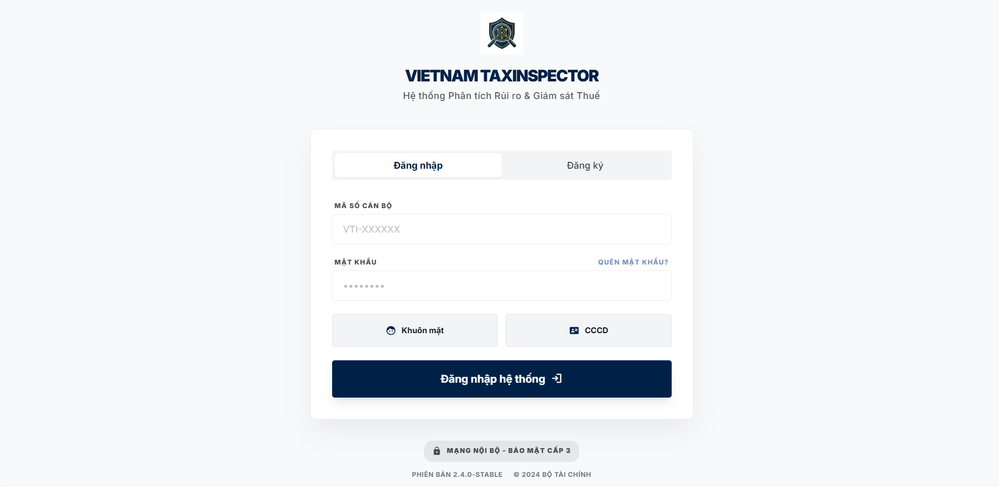
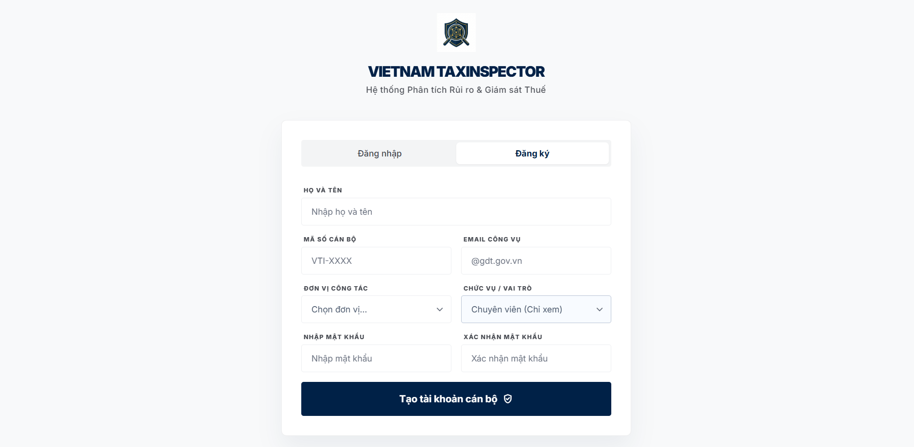

# 🇻🇳 Vietnam TaxInspector
### Khai Phá Tri Thức Thuế Dựa Trên Trí Tuệ Nhân Tạo & Phân Tích Đồ Thị Điều Tra (AI-Powered Sovereign Tax Surveillance & Forensic Analytics Suite)

[](https://fastapi.tiangolo.com/)
[](https://www.postgresql.org/)
[](https://tailwindcss.com/)
[](https://github.com/pgvector/pgvector)
[](https://pytorch.org/)
[](https://networkx.org/)
[](https://xgboost.ai/)
[](https://redis.io/)
[](https://kafka.apache.org/)
[](https://www.docker.com/)
[](https://opensource.org/licenses/MIT)

---

## 📖 1. Giới Thiệu Tổng Quan & Triết Lý Thiết Kế (Executive Summary & Philosophy)

**Vietnam TaxInspector** không chỉ là một phần mềm quản lý thuế thông thường, mà là một **Hệ sinh thái Phân tích Điều tra (Forensic Analytics Ecosystem)** cấp độ Chính phủ (Sovereign-grade). Hệ thống được thiết kế hoàn toàn theo tư duy **AI-First**, nghĩa là mọi luồng dữ liệu đều đi qua các màng lọc học máy (Machine Learning) trước khi đến tay cán bộ thuế.

### 1.1. Mục Tiêu Cốt Lõi (Core Objectives)
1. **Phát hiện gian lận (Fraud Detection):** Chặn đứng các hành vi mua bán hóa đơn bất hợp pháp, sử dụng công ty "ma" (Shell companies) để trốn thuế.
2. **Quản lý Nợ đọng (Delinquency Management):** Dự báo sớm khả năng doanh nghiệp mất thanh khoản và trễ hạn nộp thuế để có biện pháp đôn đốc kịp thời.
3. **Trợ lý Ảo Điều tra (Agentic AI Assistant):** Giảm tải 90% công việc thủ công (tra cứu luật, bóc tách dữ liệu) bằng cách cung cấp một Trợ lý AI đa tác tử (Multi-Agent) có khả năng tự động truy vấn cơ sở dữ liệu và tranh biện nghiệp vụ.

### 1.2. Triết Lý Thiết Kế (Design Philosophy)
- **Sovereignty & Privacy:** Toàn bộ mô hình học máy (XGBoost, NLP, OCR) và Vector Database đều chạy On-Premise. Không một byte dữ liệu hóa đơn nào bị gửi ra các public API (như OpenAI, Google Cloud) mà chưa qua xử lý làm ẩn danh, đảm bảo tuyệt đối an ninh quốc gia.
- **Graceful Degradation:** Hệ thống được thiết kế để không bao giờ "chết" hoàn toàn. Nếu AI OCR (PaddleOCR) lỗi, nó sẽ hạ cấp xuống dùng Tesseract; nếu Tesseract lỗi, hạ xuống dùng Regex thuần túy.
- **Explainable AI (XAI):** Mọi dự báo (điểm rủi ro, xác suất nợ) đều đi kèm các chỉ số quan trọng (Feature Importances) và giải thích bằng ngôn ngữ tự nhiên để cán bộ hiểu rõ TẠI SAO AI lại đưa ra quyết định đó.

---

## 📸 2. Hình Ảnh Giao Diện (System Previews)

Hệ thống được thiết kế tối giản, loại bỏ các chi tiết thừa để giúp cán bộ tập trung tối đa vào dữ liệu điều tra:

| Trung Tâm Giám Sát (Dashboard) | Truy Vết Mạng Lưới (VAT Graph) |
| :---: | :---: |
|  |  |

| Trợ Lý Ảo Điều Tra (Multi-Agent AI) | Chấm Điểm Rủi Ro (Fraud Scoring) |
| :---: | :---: |
|  |  |

| Dự Báo Nợ Đọng (Delinquency) | Hiệu Quả Can Thiệp (Interventions) |
| :---: | :---: |
|  |  |

| Chuyên Đề Thanh Tra (Specialized Audits) | Quản Lý Hồ Sơ (Profile & Settings) |
| :---: | :---: |
|  |  |

| Hệ Thống Đăng Nhập Kín (Secure Login) | Cấp Quyền Truy Cập (Registration) |
| :---: | :---: |
|  |  |

---

## 🤖 3. Phân Hệ Đa Tác Tử (Multi-Agent Debate & ReAct Framework)

Trái tim của khả năng giao tiếp ngôn ngữ tự nhiên trong TaxInspector chính là hệ thống **Multi-Agent**. Thay vì sử dụng một mô hình LLM đơn lẻ dễ bị "ảo giác" (hallucination), chúng tôi thiết kế một kiến trúc phân tán gồm nhiều Agent chuyên biệt hoạt động dưới sự giám sát của một Orchestrator trung tâm.

### 2.1. Vòng Đời Xử Lý Ngôn Ngữ Tự Nhiên (The Agentic Lifecycle)

Quá trình xử lý một yêu cầu của người dùng đi qua 5 Giai đoạn (Phases) cực kỳ nghiêm ngặt:

**Phase 1: Ingestion & Multimodal Routing (Tiếp nhận & Phân luồng)**
Hệ thống tiếp nhận câu hỏi Text và File đính kèm qua endpoint `POST /api/tax-agent/chat/v2/with-file`.
- Nếu file là Ảnh/PDF: Gửi vào luồng Computer Vision (OCR) để trích xuất hóa đơn. Module OCR phân tích tọa độ bounding boxes để tái tạo lại bảng biểu chi tiết (Line Items).
- Nếu file là CSV: Đẩy qua bộ dò Schema (Schema Detector). Tùy thuộc vào cấu trúc cột (Columns), hệ thống tự động nhận diện đây là dữ liệu `vat_graph_csv` hay `risk_scoring_csv` để chạy phân tích ngầm bằng Pandas.
- Kết quả từ file được nhúng trực tiếp thành Text đính kèm vào bối cảnh (Context Window) của LLM để Agent bắt đầu làm việc.

**Phase 2: DAG Planning & Budgeting (Lập kế hoạch & Cấp ngân sách)**
Một câu hỏi phức tạp (VD: "Phân tích rủi ro của công ty A và đối chiếu với luật thuế GTGT") không thể giải quyết trong một bước prompt thông thường.
- **Planner Agent** sẽ phân rã (decompose) câu hỏi này thành một Đồ thị có hướng vô chu trình (DAG - Directed Acyclic Graph).
- Nó xác định: 
  - Bước 1 (Node 1) là query DB tìm công ty A.
  - Bước 2 (Node 2) là lấy mã số thuế từ Bước 1 tìm chuỗi hóa đơn trong VAT Graph.
  - Bước 3 (Node 3) là chạy RAG tìm luật đối chiếu.
  - Bước 4 (Node 4) là tổng hợp.
- Để chống vòng lặp vô hạn (Infinite Loop) - một lỗi phổ biến của AutoGPT, hệ thống áp dụng cơ chế **Budgeting**. Mỗi Node/Task chỉ được cấp tối đa `X` tokens hoặc `Y` lần gọi API. Khi hết Budget, Task sẽ bị Terminal Error và Orchestrator sẽ bẻ lái sang kế hoạch dự phòng.

**Phase 3: Tool Execution & RAG (Thực thi Công cụ & Truy xuất)**
Dựa vào DAG, hệ thống kích hoạt **ReAct Framework** (Reasoning + Acting). Tác tử được quyền chủ động sử dụng các Tools:
- `SQLQueryTool`: Chuyển đổi ngôn ngữ tự nhiên sang SQL an toàn (Text-to-SQL) để query bảng `companies`, `tax_returns`.
- `KnowledgeRetrievalTool`: Kích hoạt RAG để tìm kiếm văn bản quy phạm pháp luật.
- `GraphAnalysisTool`: Tương tác với NetworkX Backend để lấy các chỉ số Centrality từ đồ thị hóa đơn.
- `DocumentOCRTool`: Chạy model bóc tách hóa đơn trong thời gian thực.

**Phase 4: Multi-Agent Debate & Escalation (Tranh biện & Nâng cấp rủi ro)**
Đây là điểm sáng tạo nhất của hệ thống. Nếu sau khi thu thập dữ liệu, câu trả lời dự kiến có độ tin cậy (Confidence) < 0.8 hoặc bài toán có tính rủi ro cao (VD: Hoàn thuế hàng tỷ đồng), Orchestrator sẽ không trả lời ngay mà tạo ra một **Cuộc Tranh Biện (Debate)** nội bộ.
- **Auditor Agent (Kiểm toán viên):** Luôn nhìn sự việc dưới góc độ bảo vệ nguồn thu ngân sách nhà nước, cực kỳ khắt khe, săm soi các dấu hiệu trốn thuế, wash trading nhỏ nhất.
- **Legal Agent (Chuyên gia Pháp lý):** Luôn nhìn sự việc dưới góc độ bảo vệ quyền lợi doanh nghiệp dựa trên nguyên tắc "suy đoán vô tội" và quy định pháp luật hiện hành.
Hai Agent này sẽ tự đưa ra lập luận, đối chiếu chứng cứ và phản biện chéo (Cross-examination) nhau trong tối đa 3 vòng (Rounds).
- **Adjudicator (Thẩm phán):** Ở cuối cuộc tranh biện, một module tổng hợp sẽ chấm điểm lập luận. Nếu hai bên bất đồng quá lớn (phân kỳ), hệ thống sẽ kích hoạt cờ `Escalation` (Yêu cầu con người can thiệp) và lưu toàn bộ log tranh biện vào cơ sở dữ liệu `adjudication_cases`. Nếu đồng thuận, nó sẽ tổng hợp thành một đáp án dung hòa.

**Phase 5: Synthesis (Tổng hợp cuối)**
Gom toàn bộ lịch sử Tool (Bằng chứng), Debate Conclusion (Luận điểm) và Context để sinh ra báo cáo Markdown hoàn chỉnh, sắc nét hiển thị cho người dùng, kèm theo trích dẫn (Citations) chính xác nguồn luật.

---

## 👁️ 4. Phân Hệ Thị Giác Máy Tính (Computer Vision & OCR Pipeline)

Để tự động hóa việc nhập liệu hóa đơn chứng từ, hệ thống sở hữu module **DocumentOCREngine** hoàn toàn độc lập với các API đám mây bên thứ 3 (như Google Cloud Vision / AWS Textract), đảm bảo dữ liệu Thuế nhạy cảm không bao giờ bị rò rỉ ra khỏi biên giới hạ tầng quốc gia.

### 3.1. Tiền Xử Lý Ảnh Chuyên Sâu (OpenCV Preprocessing)
Tài liệu thuế thực tế (nhất là hóa đơn scan) thường xuyên bị nhăn nheo, chụp nghiêng hoặc bị con dấu đỏ đè lên chữ ký và số tiền, gây nhầm lẫn trầm trọng cho các thuật toán OCR thông thường.
- **Red Stamp Removal (Xóa mộc đỏ):** Hệ thống chuyển đổi ảnh sang hệ không gian màu HSV (Hue-Saturation-Value). Sử dụng `cv2.inRange` để tạo ra hai Mask bóc tách vùng màu đỏ/hồng (Hue 0-10 và 160-180). Sau đó dùng `cv2.bitwise_or` để gộp Mask và thay thế vùng màu đỏ bằng nền trắng (255,255,255). Điều này giúp OCR không bị nhiễu nét chữ.
- **Deskewing (Sửa nghiêng):** Sử dụng bộ lọc làm xám (Grayscale) kết hợp thuật toán phát hiện biên (Canny Edge Detection). Tiếp tục đưa qua `cv2.HoughLinesP` để phát hiện các đường kẻ ngang dọc trong bảng biểu hóa đơn. Tính toán góc nghiêng trung vị (Median Angle) từ các đường kẻ này và dùng biến đổi affine `cv2.warpAffine` để xoay thẳng ảnh tự động với độ sai số cực thấp.
- **Adaptive Binarization:** Đối với ảnh nhiễu, ánh sáng không đều hoặc tối mờ, dùng phương pháp Adaptive Gaussian Thresholding (ngưỡng thích nghi cục bộ) để làm nổi bật nét mực đen trên nền trắng nhám.

### 3.2. Động Cơ Nhận Dạng Văn Bản (OCR Backend Priority Chain)
Hệ thống sử dụng cơ chế Fallback an toàn (Graceful Degradation Chain):
1. **PaddleOCR (Primary Engine):** Tối ưu hóa cực tốt cho hệ chữ tượng hình và Tiếng Việt có dấu. Chạy dựa trên mô hình Lightweight inference, cung cấp tốc độ cao ngay cả trên CPU thông thường.
2. **EasyOCR (Secondary Engine):** Tích hợp sẵn `vi` (Vietnamese) language pack dựa trên mạng CRAFT (Character Region Awareness for Text detection). Cung cấp độ chính xác cao cho văn bản in chuẩn.
3. **Tesseract (Fallback 1):** Công cụ OCR truyền thống mã nguồn mở dựa trên mô hình học sâu LSTM (Long Short-Term Memory).
4. **Regex Only (Fallback 2):** Nếu server bị lỗi hoàn toàn các engine xử lý ảnh, pipeline hạ cấp xuống chế độ `regex_only` để bóc tách text nhúng sẵn trong file PDF thông minh (dùng `pdfplumber`).

### 3.3. Trích Xuất Thực Thể & Cấu Trúc Lưới (Invoice Entity Extraction)
Sau khi có Dữ liệu văn bản thô (Raw OCR Text), module tiếp tục xử lý NLP và Heuristics:
- **Thông tin doanh nghiệp:** Dò các chuỗi 10-13 chữ số làm Mã số thuế. Kết hợp Regex xử lý đa dòng (Multiline Parsing) để móc nối từ khóa "Người Bán/Đơn vị bán" với tên công ty nằm ở dòng kế tiếp.
- **Tiền tệ:** Trích xuất toàn bộ các số liệu, chuẩn hóa dấu phân cách thập phân, sắp xếp mảng theo thứ tự giảm dần để nhận diện chính xác Đơn giá, Thành tiền, Thuế VAT (thường là 8% hoặc 10%) và Tổng thanh toán (Grand Total).
- **Table Structure Detection (Trích xuất Bảng biểu):** Sử dụng thuật toán Y-Tolerance Clustering. Gom cụm các Bounding Boxes có tọa độ Y xấp xỉ nhau thành các dòng (Rows). Lọc các dòng có đủ cấu trúc cột (như STT, Tên Hàng, Số lượng, Đơn giá) để xây dựng lại cấu trúc lưới (Grid) của bảng hàng hóa ngay cả khi hóa đơn điện tử không hề in viền bảng (borderless).

---

## 🕸️ 5. Phân Hệ Phân Tích Mạng Lưới Điêu Tra (Forensic Graph Analytics)

Hành vi trốn thuế tinh vi nhất hiện nay là cấu kết thành lập mạng lưới mua bán hóa đơn xoay vòng qua hàng chục, thậm chí hàng trăm công ty trung gian (Shell company rings / Wash trading). Việc truy vấn bằng SQL truyền thống tỏ ra bất lực trước bài toán chuỗi liên kết sâu. Vietnam TaxInspector ứng dụng Graph AI để giải quyết triệt để vấn đề này.

### 4.1. Kiến Trúc Mạng Lưới (The VAT Graph Architecture)
Dữ liệu hóa đơn từ bảng `tax_returns` được tải lên bộ nhớ và chuyển đổi thành Đồ thị có hướng (Directed Graph) sử dụng thư viện **NetworkX**:
- **Nodes (Đỉnh):** Đại diện cho các Doanh nghiệp (định danh bằng Mã số thuế).
- **Edges (Cạnh):** Đại diện cho dòng dịch chuyển của Hóa đơn GTGT và tiền tệ từ Người Bán sang Người Mua. Cạnh mang trọng số (Weight) là tổng giá trị giao dịch.

### 4.2. Thuật Toán Cốt Lõi (Core Graph Algorithms)
- **Cycle Detection (Truy tìm chu trình khép kín):** Áp dụng thuật toán DFS (Depth-First Search) tùy chỉnh để tìm các chuỗi giao dịch đi một vòng rồi quay lại điểm xuất phát (Ví dụ: Công ty A bán cho B, B bán cho C, C lại bán ngược nguyên vật liệu cho A). Đây là dấu hiệu kinh điển của việc đảo tiền nhằm nâng khống doanh thu để lừa đảo vay vốn ngân hàng hoặc hoàn thuế.
- **PageRank Algorithm (Đo lường tầm quan trọng):** Tính toán "độ tập trung" của dòng tiền. Một công ty "ma" (F0) thường có dòng tiền bán ra khổng lồ dồn vào nhiều công ty (F1, F2) nhưng lại không có hóa đơn mua nguyên vật liệu đầu vào tương xứng. Độ lệch PageRank In/Out giúp phát hiện chính xác các "Trạm phát hành hóa đơn khống".
- **Connected Components (Các cụm cô lập):** Xác định các nhóm công ty (Sub-graphs) chỉ chuyên mua bán nội bộ với nhau nhằm thổi phồng chi phí mà không hề giao thương thực tế với thị trường bên ngoài.

### 4.3. Kiến Trúc Xử Lý Lô Cường Độ Cao (High-Throughput Batch API)
Do các thuật toán đồ thị có độ phức tạp thời gian O(V+E) hoặc O(V^3), việc xử lý hàng triệu node sẽ gây "đóng băng" (blocking) Server.
Tính năng `POST /api/graph/batch-upload` được kiến trúc theo dạng **Async Background Tasks**. Frontend sẽ không bị treo mà liên tục Polling endpoint `/batch-status/{batch_id}` (chu kỳ 2 giây) để cập nhật thanh Tiến trình (Progress Bar) thời gian thực, đảm bảo UX/UI luôn mượt mà. Kết quả cuối cùng được lưu trữ vĩnh viễn vào bảng `vat_graph_analysis_batches`.

---

## 📈 6. Phân Hệ Học Máy Dự Báo (Predictive Machine Learning)

Học máy truyền thống (Tabular Machine Learning) được tận dụng tối đa để chấm điểm rủi ro hàng loạt (Bulk Scoring) và đưa ra các dự báo định lượng trên quy mô toàn quốc.

### 5.1. Mô Hình Dự Báo Nợ Đọng (Delinquency Prediction Pipeline)
Mục tiêu là tính toán xác suất (0.0 đến 1.0) một công ty sẽ mất thanh khoản và không nộp thuế trong quý kế tiếp.
- **Thuật toán:** Triển khai **XGBoost (Extreme Gradient Boosting)** và Random Forest Classifier. Thuật toán này vượt trội trong xử lý dữ liệu dạng bảng chứa nhiều nhiễu và missing values.
- **Feature Engineering (Trích xuất đặc trưng):** Mô hình được huấn luyện dựa trên các tính năng chuyên ngành thuế:
  - `revenue_volatility` (Độ biến động doanh thu theo quý).
  - `historical_delinquency` (Tần suất trễ nộp thuế trong quá khứ).
  - `profit_margin_anomaly` (Lợi nhuận gộp bất thường so với bình quân ngành).
  - `tax_payment_delay_days` (Độ trễ dòng tiền thanh toán trung bình).
- **Hệ thống Caching & Sức khỏe (Cache Health Monitoring):** Vì việc thực thi `predict()` cho hàng vạn công ty tốn thời gian, kết quả được lưu đệm (Caching). Hệ thống có Endpoint riêng `/api/delinquency/health/cache` để giám sát độ phủ (Coverage) và độ cũ của dữ liệu (Stale Ratio). Khi Stale Ratio vượt quá 30%, Event hook cảnh báo `delinquency_cache_health_threshold_breach` sẽ được kích hoạt để quản trị viên chạy lại Batch Predict.

### 5.2. Chấm Điểm Gian Lận (Fraud Risk Scoring)
Module phân tích hành vi và gán nhãn rủi ro tổng hợp cho Doanh nghiệp:
- Thấp (Low Risk) - Xanh lá.
- Trung bình (Medium Risk) - Vàng.
- Cao (High Risk) - Đỏ (Báo động đưa vào diện Thanh tra toàn diện).
Thuật toán là sự kết hợp giữa Machine Learning phi giám sát (Unsupervised Anomaly Detection như Isolation Forest) và Hệ chuyên gia (Rule-based Expert System).

### 5.3. Luồng MLOps Chuyên Biệt (Specialized Training Pipelines)
Đối với các nghiệp vụ có rủi ro tài chính khổng lồ như *Hoàn Thuế GTGT (VAT Refund)* hay *Thanh tra sau thông quan (Audit Value)*, quy trình cập nhật model là cực kỳ khắt khe:
- **Quality Gates:** Mô hình sau khi Train sẽ được kiểm tra chéo Precision/Recall. Chỉ khi `overall_pass=true` hệ thống mới cấp phép đi tiếp.
- **Pilot Phase:** Chạy thử nghiệm (A/B Testing dạng hẹp) trên một tập dữ liệu biên. Thu thập sự sai lệch (Delta).
- **Go/No-Go Decision Automation:** Một Agent kiểm định độc lập sẽ tự động sinh báo cáo `specialized_go_no_go_report.json` và ra quyết định có Release Model ra Production hay không dựa trên các luật (Hard Gates) về False Positive Rate (Tránh thanh tra oan doanh nghiệp làm ăn chân chính).
- **Model Lineage:** Lưu vết toàn bộ lịch sử sử dụng Model version nào để đưa ra quyết định cho công ty nào, hỗ trợ Audit nghiệp vụ về sau.

### 5.4. Vòng Lặp Học Tăng Cường (RLHF & DPO Framework)
Nhằm liên tục tinh chỉnh văn phong và logic của Trợ lý AI, giao diện Chatbot được trang bị nút phản hồi (Thumbs Up / Thumbs Down).
- Phản hồi của cán bộ thuế (Human Feedback) sẽ được lưu vào Database cùng với toàn bộ nội dung Debate và Prompt.
- Dữ liệu này được làm giàu để tạo thành tập huấn luyện cho phương pháp **DPO (Direct Preference Optimization)**, liên tục "uốn nắn" AI Agent để nó học được "trực giác điều tra" của cán bộ thuế thực thụ.

---

## 📚 7. Quản Trị Tri Thức & RAG (Knowledge Base & Vector Database)

Để Agent không bao giờ mắc lỗi "bịa" luật (Hallucination) - điều cấm kỵ trong hành chính công, hệ thống được trang bị bộ não RAG (Retrieval-Augmented Generation) đồ sộ.

### 6.1. Kiến Trúc Cơ Sở Dữ Liệu Vector (pgvector)
Hệ thống sử dụng cơ sở dữ liệu **PostgreSQL** kết hợp chặt chẽ với extension **pgvector**.
- **Sovereign Security:** Lựa chọn `pgvector` thay vì Pinecone/Milvus SaaS đảm bảo toàn bộ dữ liệu Vector nhúng (Embeddings) của các văn bản mật, thông tư, nghị định nội bộ không bao giờ rời khỏi Server On-Premise của cơ quan nhà nước.
- **Indexing Strategy:** Triển khai thuật toán **HNSW** (Hierarchical Navigable Small World) để query không gian vector nhiều chiều cực nhanh với độ trễ (Latency) dưới 10ms, hỗ trợ fallback sang IVFFlat nếu bộ nhớ RAM vật lý bị giới hạn.

### 6.2. Thuật Toán Tìm Kiếm Lai Đa Lớp (Hybrid Search & Cross-Encoder Reranking)
Hệ thống RAG sử dụng phương pháp tìm kiếm ba tầng (3-Tier Search) phức tạp:
- **Tầng 1 - Keyword Lexical Search (BM25):** Truy vấn dựa trên tần suất xuất hiện từ khóa. Rất mạnh khi người dùng tra cứu chính xác số hiệu luật (Ví dụ: "Điểm a Khoản 1 Điều 15 Thông tư 219/2013/TT-BTC").
- **Tầng 2 - Dense Semantic Retrieval:** Tìm kiếm theo ngữ nghĩa dựa trên Embeddings 384-chiều. Rất mạnh khi người dùng hỏi các câu mơ hồ (Ví dụ: "Điều kiện để được khấu trừ thuế hàng xuất khẩu là gì?").
- **Tầng 3 - Cross-Encoder Singleton:** Sau khi Tầng 1 và 2 hợp nhất trả về 50 chunks tài liệu tiềm năng nhất, mô hình Cross-Encoder (chạy dạng Singleton trên bộ nhớ) sẽ đánh giá trực tiếp mối liên hệ giữa [Câu hỏi] và [Từng chunk tài liệu]. Nó chấm điểm Relevance Score từ 0 đến 1, sau đó Rerank (xếp hạng lại) để lấy chính xác Top 3 đoạn văn bản "vàng" nạp vào Context cho LLM.

---

## 🏢 8. Kiến Trúc Phần Mềm & Công Nghệ (Software Architecture & Tech Stack)

### 7.1. Backend (Python & FastAPI)
- **Framework:** FastAPI mang lại hiệu suất Asynchronous vượt trội, được thiết kế theo chuẩn Micro-routers phân tách rõ ràng các miền nghiệp vụ (Domain-Driven Design): `/api/ml`, `/api/graph`, `/api/tax-agent`, `/api/delinquency`, `/api/simulation`.
- **ORM & Database Interactor:** Sử dụng **SQLAlchemy 2.0** cho toàn bộ thao tác CSDL.
- **Security Validation:** Áp dụng Pydantic models để validate chặt chẽ Payload đầu vào, chống SQL Injection và XSS.
- **Resource Management:** Dependency Injection (`Depends(get_db)`) được sử dụng triệt để nhằm đảm bảo Connection Pooling luôn sạch sẽ và tối ưu bộ nhớ.

### 7.2. Frontend (Modern Vanilla JS & TailwindCSS)
- **Triết lý Zero-Bloat:** Hệ thống loại bỏ hoàn toàn các thư viện cồng kềnh (React/Vue/Angular/Webpack) để tối giản hóa việc triển khai (Deployment) trên các máy chủ đóng của Nhà nước (Không cần cài Node.js hay NPM). Mọi thứ chạy trên **ES6 Vanilla JavaScript** thuần túy và cực nhanh.
- **Design System:** Dùng **TailwindCSS** tạo giao diện theo phong cách "Office White" thanh lịch, màu chủ đạo là xanh dương đậm (Trust Blue) thể hiện sự uy tín, font chữ rõ ràng, độ tương phản cao phù hợp cho môi trường văn phòng.
- **Dynamic Interactions & Animations:**
  - Tích hợp hiệu ứng CSS Keyframes: **Laser Scanning Animation** trên khu vực upload OCR, tạo cảm giác quét tài liệu sinh động như phim viễn tưởng.
  - Sử dụng Masonry Grid Layout cho giao diện lập giả thuyết điều tra (Development Hypothesis Simulation), tiết kiệm khoảng trắng màn hình.
  - Fetch API kết hợp cơ chế Polling mượt mà cho các luồng xử lý bất đồng bộ, Modal Overlays chuyên nghiệp cho các hộp thoại chức năng.
  - Tích hợp tính năng "Tủ Đồ" (Wardrobe) thay đổi giao diện Avatar AI với chủ đề Lụa tơ tằm (Silk-themed variants) nhằm tăng tính tương tác và cá nhân hóa.

### 7.3. Cấu Trúc Cơ Sở Dữ Liệu Cực Đại (Database Schema Details)
Quản trị toàn bộ bởi file lược đồ `Database/init_db.sql` và hệ thống migrate:
- **Core Entities:** `users` (Cán bộ), `companies` (Hồ sơ pháp nhân doanh nghiệp).
- **Financial Data:** `tax_returns` (Tờ khai thuế định kỳ), `tax_payments` (Lịch sử nộp tiền vào ngân sách).
- **Analytics & ML:** `fraud_risk_scores` (Lưu vết điểm rủi ro qua từng quý).
- **Forensic Graph:** `vat_graph_nodes` (Trạng thái đỉnh đồ thị), `vat_graph_edges` (Liên kết giao dịch), `vat_graph_analysis_batches` (Tiến trình chạy Batch Graph).
- **Agentic Brain:** `agent_execution_plans` (Lưu trữ cây DAG task), `adjudication_cases` (Lưu toàn bộ lịch sử Debate đa tác tử để Audit), `agent_case_workspace` và `legal_claim_verifications` (facts, assumptions, citations, claim verification, escalation reason theo session).
- **Vector DB / Legal KG:** `knowledge_chunks`, `knowledge_chunk_embeddings`, `kg_entities`, `kg_relations` (lưu text, vector, citation spans và quan hệ pháp lý cho Hybrid RAG + GraphRAG).

---

## 🔒 9. Bảo Mật & Phân Quyền Giám Sát (Security & Governance)

An ninh thông tin là yếu tố sống còn, quyết định sự thành bại của dữ liệu ngành Thuế:
- **Authentication & Encryption:** Mật khẩu cán bộ được băm và mã hóa một chiều bằng thuật toán `PBKDF2` tiêu chuẩn Mỹ (có Salting ngẫu nhiên). Xác thực phiên làm việc bằng chuỗi JWT (JSON Web Tokens) với thời hạn truy cập ngắn (Short-lived access).
- **Role-Based Access Control (RBAC):** Chặn API cực kỳ nghiêm ngặt tại tầng Route. Ví dụ: Chỉ tài khoản cấp `admin` mới được quyền kích hoạt các lệnh Batch Predict làm tốn tài nguyên hệ thống hoặc thay đổi cấu hình Agent.
- **OTP/Outbox Reset Password Logic:** Để hỗ trợ phát triển nội bộ (Local Environment) khi chưa có hệ thống Mail Server (SMTP) thực của tổng cục, hệ thống giả lập luồng cấp lại mật khẩu qua email bằng cách ghi mã OTP vào file ẩn `.otp_outbox.log`, đảm bảo Dev có thể test luồng Quên mật khẩu trơn tru.
- **Môi trường kín (Air-gapped readiness):** File `.gitignore` được thiết lập chặt chẽ, loại bỏ hoàn toàn việc vô tình commit các file cấu hình `.env`, Access Keys, và các tệp CSDL SQLite nhạy cảm lên hệ thống quản lý mã nguồn (GitHub/GitLab).

---

## 🚀 10. Hướng Dẫn Vận Hành Hệ Thống (Operations & Quick Start)

Đây là tài liệu hướng dẫn nhanh để đưa toàn bộ cụm hệ thống lên và chạy ổn định trong vòng 10 phút.

### 9.1. Chuẩn Bị Hệ Sinh Thái Hạ Tầng (Prerequisite Setup)
Đảm bảo máy chủ (Windows Server / Linux Ubuntu) đã cài đặt:
- Python phiên bản `3.9` đến `3.11`.
- Cơ sở dữ liệu PostgreSQL phiên bản `14` trở lên.
- Cài đặt extension `pgvector` cho PostgreSQL (Bắt buộc để chạy tính năng Semantic Search).
Tạo một cơ sở dữ liệu trống mang tên `TaxInspector`. Sử dụng công cụ `psql` hoặc pgAdmin để chạy toàn bộ script DDL từ file `Database/init_db.sql` nhằm tạo móng cho hệ thống bảng biểu.

### 9.2. Triển Khai Máy Chủ Backend API
Mở cửa sổ Command Prompt/Terminal, di chuyển vào thư mục gốc của dự án:
```bash
cd Backend

# Khởi tạo một môi trường Python ảo (Virtual Environment) để cô lập thư viện
python -m venv venv

# Kích hoạt môi trường ảo
# Trên Linux/Mac:
source venv/bin/activate  
# Trên Windows:
.\venv\Scripts\activate

# Cài đặt danh sách thư viện cốt lõi (Bao gồm PyTorch, FastAPI, SQLAlchemy, NetworkX, XGBoost)
pip install -r requirements.txt

# (Nâng cao) Cài đặt bổ sung thư viện cho tính năng OCR hình ảnh
pip install easyocr opencv-python

# Khởi động máy chủ API nội bộ (ASGI Server) bằng Uvicorn
uvicorn app.main:app --reload --port 8000
```
Khi thấy dòng log `Application startup complete.`, Backend đã sẵn sàng ở port `8000`.

### 9.3. Triển Khai Máy Chủ Frontend Web Server
Do sử dụng ES6 Modules, trình duyệt sẽ chặn việc mở file HTML trực tiếp (lỗi CORS `file://`). Cần chạy một Web Server tĩnh nhẹ nhàng. Mở một Terminal mới:
```bash
cd Frontend
python -m http.server 3000
```
Sử dụng trình duyệt Chrome/Edge truy cập vào địa chỉ: **http://localhost:3000** để chiêm ngưỡng giao diện.

### 9.4. Sinh Dữ Liệu Giả Lập & Khởi Tạo Bộ Đệm (Mock Data & Seeding)
Một hệ thống BI Dashboard trống rỗng sẽ không thể hiện được sức mạnh. Cần sinh bộ dữ liệu (Mock Data) giả lập 5,000 công ty để hệ thống hoạt động:
```bash
# Trở về thư mục gốc của dự án
# Sinh dữ liệu pháp nhân và báo cáo thuế cơ bản
python Backend/data/generate_mock_data.py
python Backend/data/seed_db.py

# Sinh dữ liệu dòng tiền thanh toán (Cần thiết cho tính năng Delinquency)
python Backend/data/seed_tax_payments.py --reset --companies 5000 --seed 42

# Chạy làm đầy bộ đệm tính toán (Delinquency Cache) tự động chia lô
python -m app.scripts.refresh_delinquency_cache --base-url http://127.0.0.1:8000 --chunk-size 500 --refresh-existing
```

### 9.5. Chạy Kiểm Tra Sức Khỏe Tự Động (Smoke-Test Automation)
Xác minh toàn bộ các Endpoints, kết nối CSDL và các Mô hình đã thực sự online hay chưa trước khi bàn giao:
```bash
python -m app.scripts.run_local_readiness_smoke --base-url http://127.0.0.1:8000
```
Màn hình console xuất hiện dòng chữ xanh `ALL SYSTEMS GO` nghĩa là hệ thống đã hoàn hảo.

### 9.6. Vận Hành Đường Ống MLOps Chuyên Biệt (Specialized Models)
Đây là quy trình huấn luyện định kỳ (thường là hàng tháng) dành cho cán bộ Data Scientist để đưa mô hình mới vào Pilot:
```bash
# 1) Khởi chạy Train Pipeline (Skip-seed để giữ nguyên dữ liệu gốc)
python Backend/app/scripts/run_specialized_training_pipeline.py --skip-seed

# 2) Tự động sinh báo cáo và ra Quyết định Release (Go/No-Go Decision)
python Backend/app/scripts/run_specialized_go_no_go_review.py

# 3) Chạy Unit Test / Regression Test đảm bảo chất lượng Pipeline không bị gãy
python -m pytest Backend/tests/test_monitoring_kpi_workflow.py -q
```

---

## 🏆 11. Tầm Nhìn & Lộ Trình Phát Triển (Future Roadmap)
Vietnam TaxInspector được thiết kế để liên tục tiến hóa. Các chức năng dự kiến tích hợp trong Phase tiếp theo:
- [x] Chuyển đổi kiến trúc RAG sang **Legal GraphRAG v2**: Knowledge Graph, authority path, effective-date reasoning, official-letter scope và relation path.
- [x] Nâng cấp trích xuất bảng biểu với **Table Transformer**; LayoutLMv3 vẫn là tùy chọn nâng tiếp cho document understanding nhiều trang/phức tạp.
- [x] Thêm **Legal Consultant Brain**: nối local `TaxAgentLLM` vào synthesizer khi artifact sẵn sàng, kèm verifier claim-to-citation, clarification slots và agent workspace audit.
- [x] **RLHF/DPO Pipeline**: Hệ thống tự học & tiến hóa qua phản hồi của Thanh tra viên (Human-in-the-loop fine-tuning).
- [x] **Dockerization & Microservices**: Đóng gói toàn bộ 6 containers (FastAPI, Model Server, Redis, Kafka, PostgreSQL, Nginx) với `docker-compose up`.
- [x] **Event-Driven Architecture (Kafka)**: Real-time invoice streaming pipeline phát hiện gian lận hóa đơn điện tử tức thì.
- [x] **Model Serving Gateway**: Singleton cache + LRU eviction giải quyết triệt để bài toán OOM khi chạy nhiều DL models đồng thời.
- [x] **Multi-Tenant Session Management**: Dynamic session isolation hỗ trợ hàng trăm Thanh tra viên làm việc song song.
- [ ] Phát triển hệ sinh thái di động: Xây dựng ứng dụng **Mobile App PWA** (Progressive Web App) gọn nhẹ cho phép cán bộ thuế chụp ảnh chứng từ và query hệ thống Agent ngay tại hiện trường cơ sở doanh nghiệp.
- [ ] Liên minh Dữ liệu (Federated Learning): Áp dụng kỹ thuật Học máy Liên kết để các Cục thuế Tỉnh/Thành phố có thể cùng nhau huấn luyện mô hình Fraud chung mà tuyệt đối không cần chia sẻ/sao chép cơ sở dữ liệu gốc của địa phương mình, đảm bảo bảo mật dữ liệu tuyệt đối.
- [ ] **Kubernetes Orchestration (K8s)**: Helm charts cho auto-scaling, rolling updates, và zero-downtime deployment trên cloud infrastructure.

---

## 🐳 12. Kiến Trúc Vi Dịch Vụ & Triển Khai Docker (Microservices & Docker Deployment)

TaxInspector sử dụng kiến trúc **6-Container Microservices** để đảm bảo tách biệt hoàn toàn (Isolation) giữa các thành phần, tối ưu hóa tài nguyên RAM/CPU và cho phép triển khai trên bất kỳ máy chủ nào chỉ bằng một lệnh duy nhất.

### 12.1. Sơ Đồ Kiến Trúc Triển Khai (Deployment Architecture)

```
┌─────────────────────────────────────────────────────────────────────┐
│                    Docker Compose Stack                            │
│                                                                     │
│  ┌────────────────┐    ┌──────────────────┐    ┌───────────────┐   │
│  │  tax-frontend   │───▶│  tax-api-server   │───▶│tax-model-server│  │
│  │  (Nginx :3000)  │    │  (FastAPI :8000)   │    │(PyTorch :8001) │  │
│  │                 │    │                    │    │                │  │
│  │  Static HTML/   │    │  Multi-Agent       │    │ VAE Anomaly    │  │
│  │  CSS/JS +       │    │  Orchestrator,     │    │ Transformer    │  │
│  │  Reverse Proxy  │    │  LLM, RAG, SSE     │    │ GNN Fraud      │  │
│  └────────────────┘    └──────┬───┬────────┘    └───────────────┘   │
│                               │   │                                 │
│                  ┌────────────┘   └───────────┐                     │
│                  ▼                             ▼                     │
│            ┌──────────┐                 ┌──────────┐                │
│            │tax-redis  │                 │tax-kafka  │               │
│            │ (6379)    │                 │ (9092)    │               │
│            │           │                 │           │               │
│            │Feature    │                 │Invoice    │               │
│            │Cache +    │                 │Events +   │               │
│            │Model Meta │                 │Anomaly    │               │
│            └──────────┘                 │Alerts     │               │
│                                          └──────────┘               │
│            ┌──────────┐                                             │
│            │tax-postgres│                                            │
│            │ (5432)    │                                             │
│            │           │                                             │
│            │pgvector + │                                             │
│            │Full Schema│                                             │
│            └──────────┘                                             │
└─────────────────────────────────────────────────────────────────────┘
```

### 12.2. Mô Tả Từng Container

| Container | Image | Port | Chức năng | RAM Limit |
|---|---|---|---|---|
| `tax-postgres` | `pgvector/pgvector:pg17` | 5432 | CSDL chính + Vector Search | - |
| `tax-redis` | `redis:7-alpine` | 6379 | Feature cache + Model metadata + Alert queue | 256MB |
| `tax-kafka` | `bitnami/kafka:3.9` | 9092 | Event streaming (KRaft mode, không cần Zookeeper) | - |
| `tax-model-server` | Custom (PyTorch CPU) | 8001 | DL inference: VAE, Transformer, GNN (Singleton cache) | **2GB** |
| `tax-api-server` | Custom (FastAPI) | 8000 | Multi-Agent Orchestrator, LLM, RAG, SSE, CRUD | **4GB** |
| `tax-frontend` | `nginx:alpine` | 3000 | Static UI + Reverse proxy + SSE passthrough | - |

### 12.3. Khởi Chạy 1-Click (One-Click Deployment)

```bash
# 1. Clone repository
git clone https://github.com/TruongVinhKiet/Vietnam-TaxInspector.git
cd Vietnam-TaxInspector

# 2. Cấu hình môi trường
cp .env.example .env
# Sửa .env: đặt mật khẩu DB, API keys, v.v.

# 3. Khởi chạy toàn bộ 6 services
docker-compose up -d

# 4. Kiểm tra trạng thái
docker-compose ps

# 5. Truy cập hệ thống
#    Frontend:  http://localhost:3000
#    API Docs:  http://localhost:8000/docs
#    Model API: http://localhost:8001/docs (internal)
```

### 12.4. Các Tính Năng Hạ Tầng Nổi Bật

**🧠 ModelServingGateway (Singleton Model Cache):**
Thay vì 6 lần `torch.load()` mỗi request, hệ thống chỉ load model **1 lần duy nhất** và cache trong RAM. Khi cache đầy, cơ chế LRU (Least Recently Used) tự động giải phóng model ít dùng nhất. Metadata về hiệu năng (load time, access count) được đồng bộ qua Redis.

**⚡ Kafka Streaming Pipeline (Real-time Fraud Detection):**
Khi hóa đơn điện tử mới được phát hành, event được đẩy vào Kafka topic `invoice.created`. Pipeline tự động:
1. Tính toán feature tăng dần (Welford's Algorithm) — O(1), không cần query SQL.
2. Cache feature vào Redis.
3. Chạy VAE anomaly scoring.
4. Nếu phát hiện bất thường → publish alert sang topic `invoice.anomaly` → Push notification tới Thanh tra viên.

**🔒 Multi-Tenant Session Isolation:**
Mỗi tab browser tạo ra một `session_id` duy nhất (`sessionStorage`). Dữ liệu phân tích, lịch sử đối thoại và feedback DPO được cách ly hoàn toàn giữa các Thanh tra viên.

---
**Nhà Kiến Trúc Phần Mềm & Phát Triển Cốt Lõi:** [TruongVinhKiet](https://github.com/TruongVinhKiet)

*LƯU Ý BẢO MẬT: Đây là tài liệu kiến trúc phần mềm chuyên sâu của dự án Vietnam TaxInspector. Hệ thống này được xây dựng với mục đích nghiên cứu, demo và minh họa tiềm năng ứng dụng của Giải pháp Công nghệ Số AI tiên tiến vào Quản lý Hành chính công nhà nước. Nghiêm cấm mọi hành vi sao chép hệ thống để phục vụ các mục đích phi pháp hoặc sử dụng sai trái dữ liệu nghiệp vụ.*

